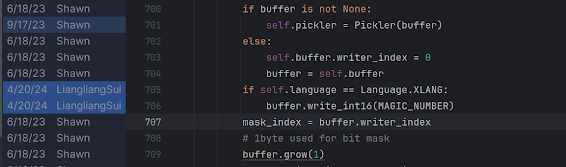
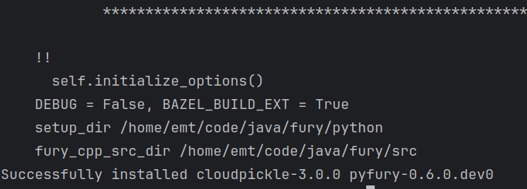
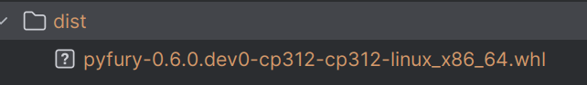

# 记使用apache Fury打包pypi踩坑流程

目前主流前后端交互多是用JSON，可读性比xml高很多，但是序列化性能适中，体积占用也大。MongoDB有个bson格式，能减少json体积，二进制形式，无可读性。google有个Protobuf在grpc中用的多，性能和体积都比json好，要写个.proto文件也就是schema规定一下传输格式。对于跨语言来说是挺大的优势，显式比隐式好，按照规范来接入对交互性来说是极为有利的。

Fury在序列化、反序列化的速度都比Protobuf好，体积还更小，所以选用它也自然而然。同时支持跨语言序列化（文档里写了一句 [跨语言序列化并不稳定，请勿在生产环境中使用。](https://fury.apache.org/zh-CN/docs/guide/xlang_type_mapping)），Fury本身是Java写的，可以替换jdk自带的序列化包，跨语言支持Python/C++/Golang/Javascript/Rust，当然对Java支持是最好的。Go的话拉源码下来直接导入用没啥大问题。Python是pip拉下来的，官方示例有些小瑕疵但不影响（如果有空的话不知道能不能发PR修一下）。Fury的pip包不支持win，这点在pip包里挺常见的。

比较简单的测试当然是序列化完存到文件里，再读取文件来反序列化。按官方demo跑，Go和Python不跨语言都可以，于是便想尝试一下跨语言调用，也就是Python/Go写然后另一个读。果不其然，的确不稳定，跑不起来。

琢磨了下Python写Go读的情况，Go报了一个二进制文件不以magic number开头的错，翻文档可以看到这是用来标记是Fury序列化的格式（作者说是能识别出来自哪个语言的编码然后可以加速反序列化），Go读/写文件的开头的确有对应的magic number，但是Python翻遍了也没见着。当前情况Fury都是选择跨语言模式（叫XLANG，Fury定义的，不重要）。Go在源码那里可以看到确实加了句如果是XLANG会写入一个magic number。去Pypi下了个最新的0.4.1版，的确没有，23年12月（time.now(), 24年9月）的包，应该不会太旧吧。按理说这规范都不遵，跨语言跨了个寂寞。再跑去Fury源码那里看了下，有的，而且是2024.4.20加的



发了issue过去请求作者打包新版了，但是等作者回应可能得一段时间，有源码那就自己动手打包得了。之前也并没有试过pypi打包，在此顺便学一下打包发行，在fury项目可以看到是用github action自动打包，py的打包脚本在[这里](https://github.com/apache/fury/blob/main/.github/workflows/release.yaml)。

分为以下几步

1. 安装Python
2. 安装bazel
3. 构建二进制 （轮子，wheel，手动翻译）
4. 将（轮子）推送到pypi（非必要）

fedora自带Python，bazel可以通过[这里](https://docs.bazel.build/versions/5.4.1/install-redhat.html)来安装

先装一下插件

```shell
sudo dnf install dnf-plugins-core
```

然后再启用第三方仓库，安全性此处不做保证

```shell
sudo dnf copr enable vbatts/bazel
sudo dnf install bazel4
```

然后就是喜闻乐见的造轮子环节，build wheel。需要安装python-devel，还有gcc全家桶。

再就是按照说明文档的

```shell
pip install pyarrow==14.0.0 Cython wheel numpy==1.26.4 pytest
```

numpy注意下选1.26.4就行，2.0不支持

```shell
pip install -v -e .
```

虽然报的错比我写的代码还多，但是不影响，对着输出直接grep fatal和error即可，再安装一些包就行。



构建完了就可以打包了。

```shell
python setup.py bdist_wheel --dist-dir=./dist
```

最后得到轮子（大雾）



再装上。

美滋滋Fury跨语言调用。
