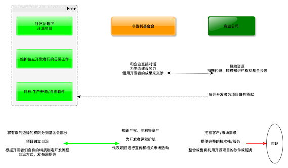
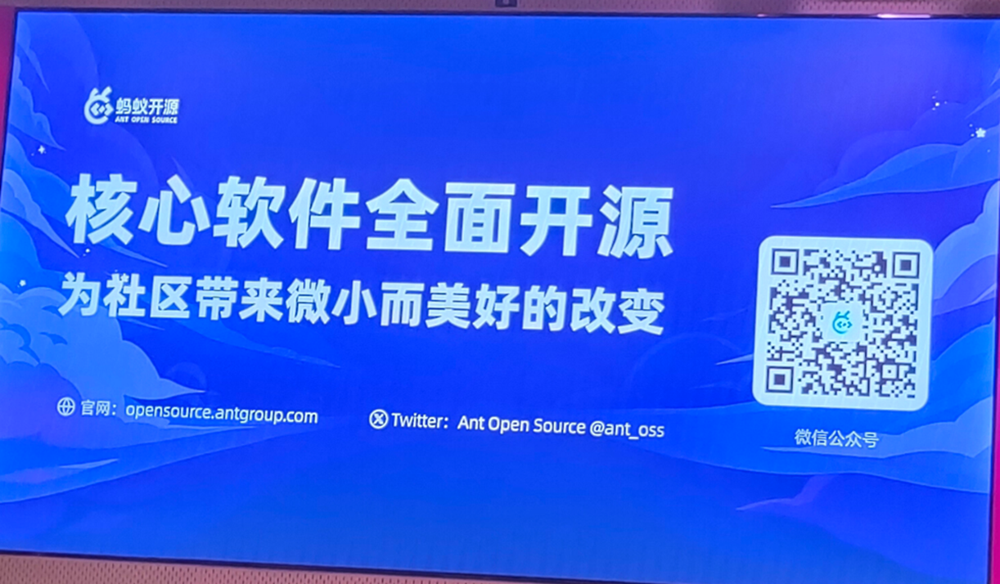
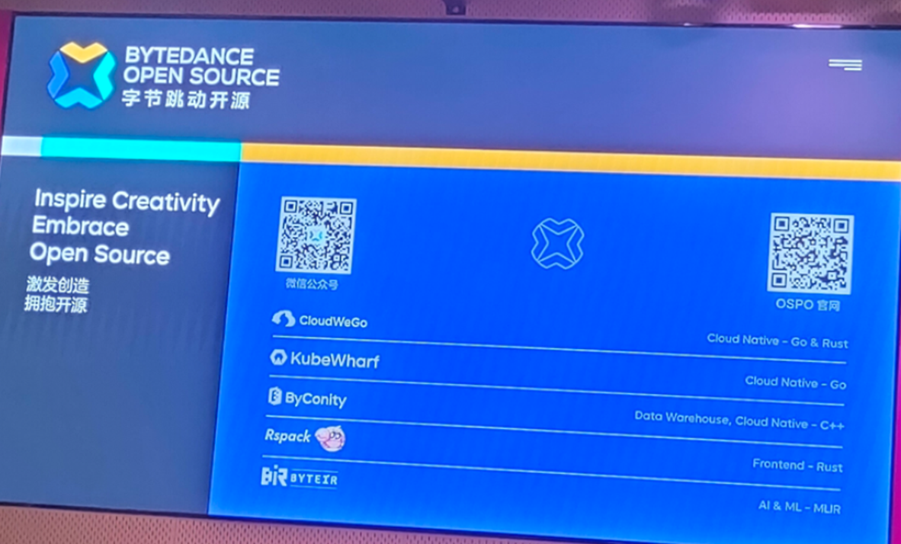
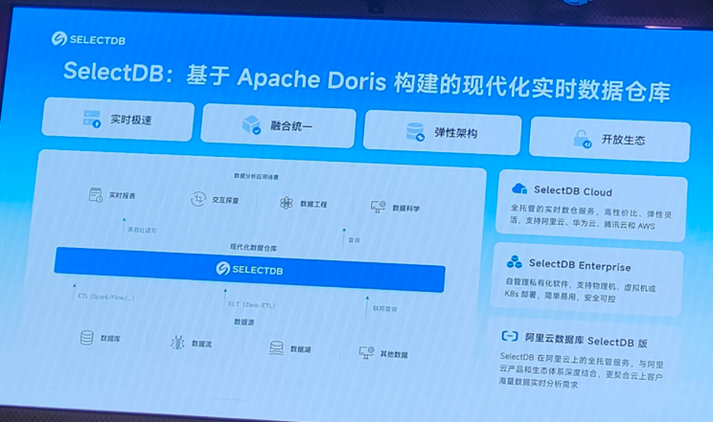
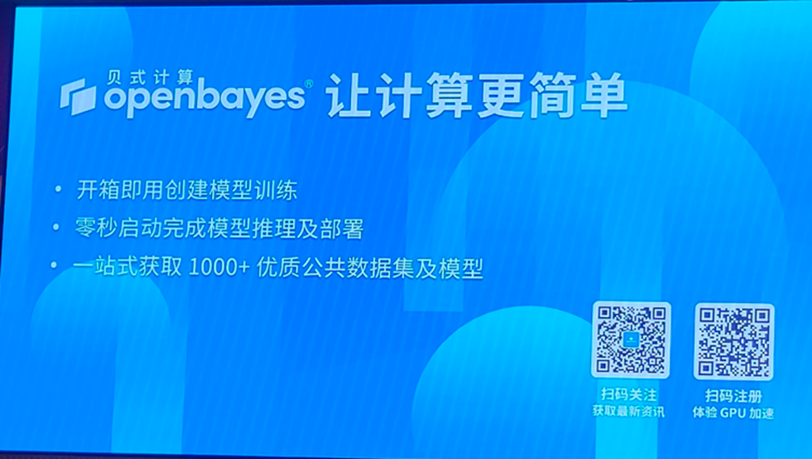
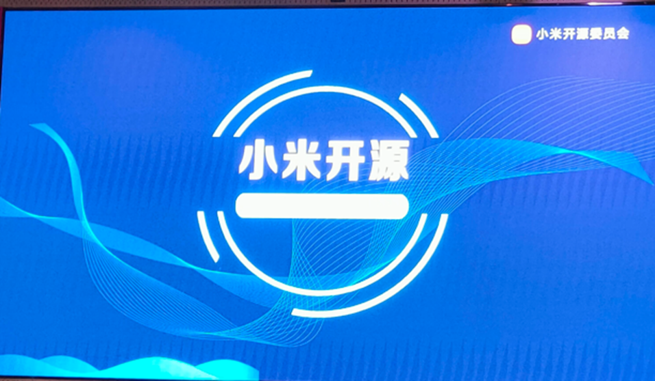
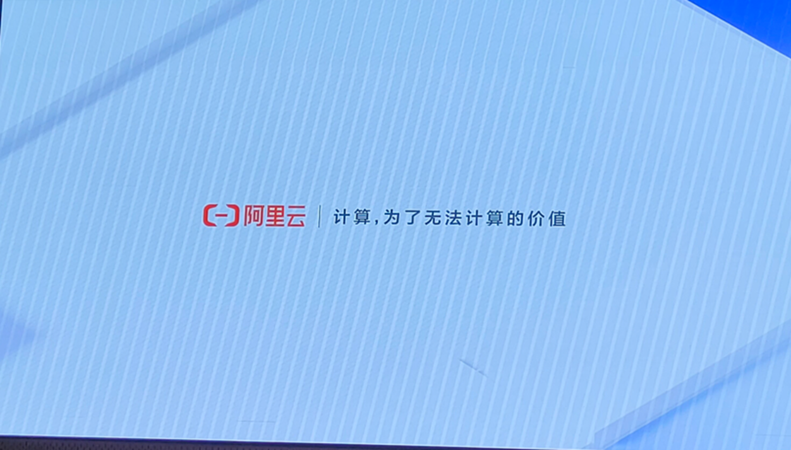

# 参观阿帕奇软件基金会亚洲大会 2024

## 什么是Apache软件基金会

> Apache软件基金会（Apache Software Foundation，简称为ASF），是一家美国的非营利组织，旨在支持各类开源软件项目。ASF最初由Apache HTTP Server的一群开发者组成，并在1999年3月25日正式成立。 截至2021年，其总成员数大约在1000名。

（上述内容来自Wikipedia）

ASF比较出名的一个项目是一个叫httpd的HTTP服务器（LAMP当中的A，linux+apache+mysql+php）。同类型的项目有俄罗斯人开发的nginx，微软的IIS，还有cloudflare刚推出来不久的的使用rust开发的Pingora。

## 基金会担任的角色

图片来自[此处](https://opensourceway.community/posts/foundation_introduce/foundation-introduce-in-fascinate-os/)

以Fedora社区和RedHat公司来举例，开源的一种商业模式是将产品分为社区版和商业版，社区版开源，商业版则是提供更多服务。Fedora是RHEL的上游，大约半年更新一个大版本，时间主要是5月和11月，故意避开重大节日以保证发版正常进行。这个更新速度对于企业用户追求的稳定是难以接受的。这个发行版主要是用来实验新功能，比如btrfs之类，待稳定后再集成进RHEL，现在RHEL有些是xfs。RHEL面对的主要是企业用户。对应的一个社区版就是CentOS，这个在国内比较出名，原因是进来的早而且稳定。它是RHEL的下游，不过最近RedHat将其转变为CentOS Stream，即不再像以往的CentOS 7一样稳定，即抽到RHEL上游，Fedora下游的位置大概，此举被视为背叛开源。引来Oracle嘲讽（Oracle不太适合跳出来嘲讽，它的MySQL和Java开源一言难尽），SUSE宣布加大投资开发与RHEL兼容的发行版。CentOS联合创始人之一单开门户，又搞了一个发行版Rocky Linux，有点像MariaDB之于MySQL。RedHat也有单独发文回应，都是后话了。

基金会背后基本都有大公司的影子，社区的主要领导者角色也基本由大公司的人担任，社区主要负责写代码，其他的事比如推广宣传、线下线上会议、资金管理等都由基金会代劳，商业公司则通过基金会和社区紧密结合，是一种共生的关系。大商业公司对社区的影响力基本都很大，在Linux社区倒是有个有意思的现象，有一件事是RedHat想跟上window步伐给内核搞secure boot，希望linus合入这个补丁（事情不是这么简单），linus的回应很直接。可以看看这个[链接](https://www.reddit.com/r/linux/comments/18yoho/linus_tells_developers_to_not_suck_off_microsoft)

比较著名的基金会有自由软件基金会（ FSF ），Apache软件基金会（ASF）、Linux基金会、Mozilla 基金会、Eclipse 基金会、GNOME基金会、云原生计算基金会（CNCF）、Rust 基金会、Python基金会、开放原子开源基金会等。

一些开源的例子：

- GNU编译器套装（GNU Compiler Collection，缩写GCC）：1985年由理查德·马修·斯托曼开始发展，现在由自由软件基金会负责维护工作。截至2019年，GCC大约有1500万行代码，是现存最大的自由程序之一。（GNU，GNU's Not Unix!，无限递归）
- Linux：斯托曼认为 Linux 应该被称作 GNU/Linux，Linux狭义是指Linux内核，现有的Linux发行版除了内核以外提供的绝大部分软件均来自GNU工程。目前内核依旧由Linus维护。
- Firefox：Mozilla基金会领导开发，自由开源的网页浏览器。
- Kubernetes：用于自动部署、扩展和管理“容器化应用程序”的开源系统。由Google设计并捐赠给CNCF（今属Linux基金会）来使用。
- Kafka：消息队列，由Apache软件基金会维护，使用Scala和Java编写。

## 大会背景

> - CommunityOverCode（原名 ApacheCon）是 Apache 软件基金会 (ASF) 的官方全球会议系列。
> - CommunityOverCode 计划充满活力，每次活动都会不断发展，内容由精选的 Apache 项目开发人员和用户社区直接推动。CommunityOverCode 在协作、供应商中立的环境中提供最先进的内容，其中包括大数据、云、社区开发、金融科技、物联网、机器学习、消息传递、编程、搜索、安全、服务器、流媒体、Web 框架等方面的最新开源进展。

（ctrl c v官方原话的）

## 会议协办方（赞助商）

拿门锁拍的，av画质

## 会议日程

在杭州举办，时间为7.26-7.28，每天分为上午和下午，上午是主会场，下午是多个主题多个分会场。
日程具体 <https://asia.communityovercode.org/schedule.html> (每年有新的日程时会刷新，2025年将在北京举办)
我由于时间原因只参加了最后一天的会议。

会议全程有录播回放，[链接](https://www.youtube.com/watch?v=7uIAeegYwLQ&list=PLU2OcwpQkYCw-J71WjgmeD9BYOK67xjG2)

### 7.28 上午日程

1. [开源人才的能力评估与培养](https://www.youtube.com/watch?v=jlC3JnEhaWE&list=PLU2OcwpQkYCw-J71WjgmeD9BYOK67xjG2)
2. [用开源构建你的职业生涯](https://www.youtube.com/watch?v=anObj3pjYr4&list=PLU2OcwpQkYCw-J71WjgmeD9BYOK67xjG2&index=74)
3. [一位工程师在 Apache 坚持且热爱的开源之旅](https://www.youtube.com/watch?v=CMAyGhb0mpA&list=PLU2OcwpQkYCw-J71WjgmeD9BYOK67xjG2)
4. [非技术人在开源社区的成长](https://www.youtube.com/watch?v=tiQmFBE_H_o&list=PLU2OcwpQkYCw-J71WjgmeD9BYOK67xjG2)
5. 闪电演讲

此处是应该写点什么的，但是我发现我对开源也仅限于了解而不是有过丰富的实践，就算了，待到以后再来补充了。