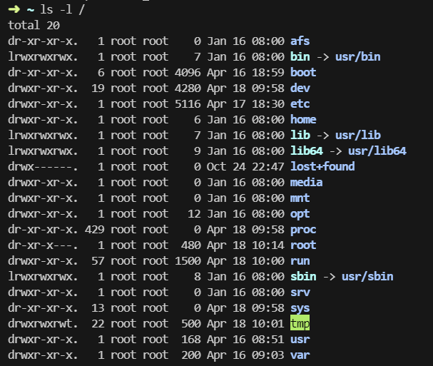
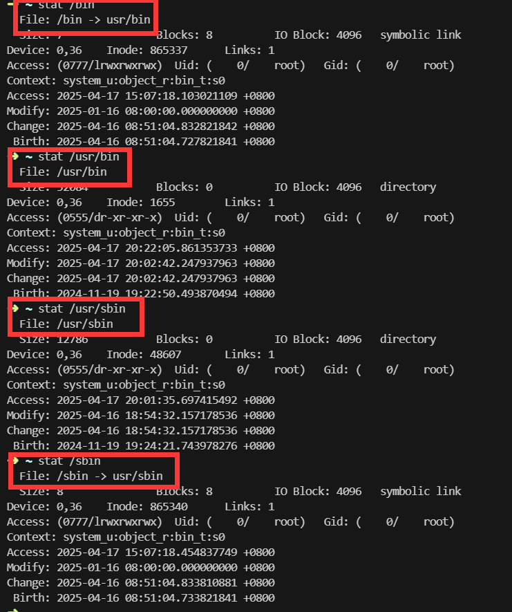

# 软链接与硬链接

## 0. 前言

最近在上Linux的课，刚好提到了软链接与硬链接，以及一些inode的知识。想着这个用到的地方还挺多，以及经常看到相关的blog介绍（这个内容比较散，放到最后来介绍），就顺便记录下来，以供后来者参考。

## 1. 什么是 inode

从抽象的角度来说，我们希望计算机能把我们输入的信息存储下来，在需要的时候能被读取出来，对应到文件里面也就是写、读两个最基本的操作。那么就需要有一种方式来说明我们要操作的对象，在这里是文件名（对于内存来说，通过变量名来操作变量，实际是通过内存地址来操作内存指定地址上的数据）。文件是一串由0101组成的字符串，可以用于表示数据信息。除此在外，还需要有一个数据结构来指示这个文件是啥、存在了哪里等之类的用于描述这个文件的元数据信息。

即 文件 = 元数据信息 + 文件内容。

为什么要有元数据信息？因为文件内容仅有0101011101这样的信息，没有元数据信息，是无法理解这个文件的含义的。如果去掉元数据信息，直接操作文件内容，等价于人脑记忆了在外存的这个地址存了什么内容，这个内容有多长，内容是用来做什么的。外存的读写速度、容量明显优于人脑，我们只需要额外付出一点空间代价记录一下元数据信息即可更加方便的操作和管理文件，故存储元数据信息于外存而不是人脑的做法是必然的。

从具体来看，文件名似乎应当存入元数据信息这一块。早期的确有这种做法，把文件名算进来了。

但考虑一下实际应用场景，去读元数据的时候，需要将其加载到内存当中，由于外存速度和内存速度不在一个量级，一般加载元数据的时候会选择多加载几个，不然等会还得跑去外存再拿一次。那么现在问题来了，如果元数据信息过长，每次加载的量固定的话，能加载进来的元数据信息就会偏少。大部分时候其实都只是ls看看当前目录啥情况。

所以文件系统里就有一种常见做法，把文件名单独抽出来，其他元数据信息组成一个数据结构([inode](https://github.com/torvalds/linux/blob/master/include/linux/fs.h#L672),index node)。操作文件的时候首先通过一张索引节点表，这个索引节点表记录了文件名、索引节点号，根据文件名去查表拿到索引节点号。通过索引节点号能检索到索引节点，索引节点里存储了文件的各种元数据信息，比如大小、创建时间、修改时间、类型、权限、**链接计数**、**文件物理位置**。在得到文件物理位置后就可以直接操作文件了。 (由OS来直接操作文件而不是由用户来操作，这样能很大程度上保证文件的一致性和提供良好的操作接口，read、write即可)

这个操作就是把常用的被检索的部分 ->  文件名 ，抽取了出来，检索的时候就能少加载几次外存，大幅提升检索性能。在查找到了inode number后，仍然需要跑去外存读取看看inode的具体内容。那么就很自然而然的，内存中维护了一张内存i节点表，这里存了被用过的inode，OS如果等会还用到这个inode，就别跑去外存了，内存有，读内存的就行。（这里和内存里的那个快表原理不能说相似，只能说是一模一样，LRU、LFU缓存淘汰算法一样可以用。）

可以通过以下命令来简单查看文件的详细信息

```shell
➜  ~ touch hello.txt
➜  ~ stat hello.txt
  File: hello.txt
  Size: 0               Blocks: 0          IO Block: 4096   regular empty file
Device: 0,36    Inode: 1234056     Links: 1
Access: (0644/-rw-r--r--)  Uid: (    0/    root)   Gid: (    0/    root)
Context: unconfined_u:object_r:admin_home_t:s0
Access: 2025-04-16 23:11:33.608368265 +0800
Modify: 2025-04-16 23:11:33.608368265 +0800
Change: 2025-04-16 23:11:33.608368265 +0800
 Birth: 2025-04-16 23:11:33.608368265 +0800
```

## 2. 什么是链接

在文件系统里的链接是为了用于共享文件。共享文件也就是把文件分享给其他人，这里的分享比较特殊，不是copy一份给其他人，而是直接把文件给到对方，他对这个文件的修改对我来说我能看到。这样做是能够方便的协作完成任务，比如借助文件互相读写来通信、跨目录重用文件、指定多版本应用默认版本等。为什么不能直接让对方读写原文件，而是搞一个链接，让对方以链接的形式来操作原文件？这个确实可以，让对方直接根据路径过来读写我的原文件，但这种方式不直观也不利于使用。链接的形式很好的保证兼容性和易用性。与其写一大长串的路径来读写文件，直接一个链接放过来，对着这个链接读写就行，怎么链接过去的活由OS搞定，对我们而言是透明的，这就是易用性。

如果需要copy文件的形式，直接`cp source_file target_file`即可。

链接的形式主要有两种，硬链接、软链接，二者各有优劣。硬链接主要用于同一个文件系统下跨目录的文件共享，软链接主要用于硬链接用不了的地方。还有比较关键的一点，硬链接访问速度快一点，软链接有一个类似于重定向的操作，会稍微慢一点。不过好在二者对应用来说透明的，一般情况下不用担心二者的差别。

## 3. 硬链接

硬链接，指有2个及以上的文件指向相同的inode。文件名可以相同或者不同，跨不同目录也可以（但不能跨文件系统）。

讲硬链接之前可以参考一个比较常见的GC算法，引用计数，当对象的计数降为0说明没人用，就可以在适当的时候回收掉这个对象。
inode中有个关键变量来表示链接数，[i_nlinks](https://github.com/torvalds/linux/blob/master/include/linux/fs.h#L702)。

新建一个硬链接时i_nlinks自增1，（不需要新建一个inode，就用这个inode即可）。

当删除一个硬链接时自减1。如果计数为0说明文件已经没有人在使用了，在下次合适的时候就可以把占用的文件资源回收掉。

按照之前的操作文件的流程，文件名 -> inode number -> inode -> 物理文件，inode相同，从不同的硬链接中操作文件都是等价的。

以下可以简单来看看其用法

```shell
➜  ~ ln hello.txt hello1.txt                                                                                                                                                                                                                
➜  ~ ls -il                                                                                                                                                                                                                                 
total 4
   8206 -rw-------. 1 root root 448 Nov 19 19:26 anaconda-ks.cfg
1234056 -rw-r--r--. 2 root root   0 Apr 16 23:11 hello1.txt
1234056 -rw-r--r--. 2 root root   0 Apr 16 23:11 hello.txt
➜  ~ stat hello1.txt                                                                                                                                                                                                                        
  File: hello1.txt
  Size: 0               Blocks: 0          IO Block: 4096   regular empty file
Device: 0,36    Inode: 1234056     Links: 2
Access: (0644/-rw-r--r--)  Uid: (    0/    root)   Gid: (    0/    root)
Context: unconfined_u:object_r:admin_home_t:s0
Access: 2025-04-16 23:11:33.608368265 +0800
Modify: 2025-04-16 23:11:33.608368265 +0800
Change: 2025-04-17 15:07:44.512881384 +0800
 Birth: 2025-04-16 23:11:33.608368265 +0800
```

通过`ln source_file target_file`能对source_file创建一个硬链接。

注意对比hello.txt和hello1.txt的inode，均为1234056，说明二者为硬链接关系。也可以跨目录来创建硬链接，这样的话能更方便的共享。

下面是一个跨目录创建硬链接的示例

```shell
➜  ~ mkdir tmp                                                                                                                                                                                                                              
➜  ~ cd tmp                                                                                                                                                                                                                                 
➜  tmp ln ../hello.txt hello2.txt                                                                                                                                                                                                           
➜  tmp ls -li                                                                                                                                                                                                                               
total 0
1234056 -rw-r--r--. 3 root root 0 Apr 16 23:11 hello2.txt
➜  tmp stat hello2.txt                                                                                                                                                                                                                      
  File: hello2.txt
  Size: 0               Blocks: 0          IO Block: 4096   regular empty file
Device: 0,36    Inode: 1234056     Links: 3
Access: (0644/-rw-r--r--)  Uid: (    0/    root)   Gid: (    0/    root)
Context: unconfined_u:object_r:admin_home_t:s0
Access: 2025-04-16 23:11:33.608368265 +0800
Modify: 2025-04-16 23:11:33.608368265 +0800
Change: 2025-04-17 15:19:30.862800277 +0800
 Birth: 2025-04-16 23:11:33.608368265 +0800
```

创建硬链接有几点限制，比如不能对不存在的文件创建硬链接、不能对目录创建硬链接、不能跨文件系统等。

先来解释第一点，不存在的文件当然连inode都没有，也就无法创建硬链接。

第二点的话，目录本身也是一个文件，为啥不能对它进行硬链接？咱们的文件系统一般是组织成了有向无环图，如果允许硬链接，把父目录硬链接到了我的目录下，这时候就会发生一个很有意思的现象。从根目录/开始遍历全文件的时候，到了我父目录，然后遍历到我，开始遍历我的子目录，这时候又回到了我的父目录，这个遍历就会无法停止。出现了环，有向无环图被破坏了。所以干脆禁止对目录进行硬链接。

第三点的话，inode的概念是在使用索引节点的文件系统里才有的，不同的文件系统对这个的处理逻辑不同，编号也不同，所以无法跨文件系统。

（这里可以举几个常见文件系统，有兴趣的可以去了解了解

1. [windows目前主用的NTFS](https://zh.wikipedia.org/wiki/NTFS)
2. [U盘常用的FAT32，有文件最大4G的限制，人为限制的](https://zh.wikipedia.org/wiki/%E6%AA%94%E6%A1%88%E9%85%8D%E7%BD%AE%E8%A1%A8#FAT32)
3. [ReFS，微软推出的下一代文件系统](https://zh.wikipedia.org/wiki/ReFS)
4. [ext2，ext3，ext3，Linux中常用的文件系统](https://zh.wikipedia.org/wiki/Ext4)
5. [xfs, RedHat用的比较多](https://zh.wikipedia.org/wiki/XFS)
6. [btrfs, 下一代linux文件系统，fedora目前在主推](https://zh.wikipedia.org/wiki/Btrfs)
7. [nfs, 网络文件系统，比较常见于挂载网络磁盘](https://zh.wikipedia.org/wiki/%E7%BD%91%E7%BB%9C%E6%96%87%E4%BB%B6%E7%B3%BB%E7%BB%9F)

## 4. 软链接

软链接，比较特殊的文件，里面存储的内容是链接对象的文件路径。类似于指针，指针本身是一个变量，但是里面存储的值是指向的对象的地址。

软链接实现原理为：OS发现在访问软链接时，主动帮我们去读一下软链接里所存储的链接对象的文件路径，再依照这个文件路径重新去访问文件。这个操作对于应用来说是透明的，只需要保证指向对象存在即可和直接访问这个对象没有啥区别。经常被用来举例的是Windows里的快捷方式，二者确实比较相似。

软链接需要创建一个inode，用于保存其自身。创建软链接时不会增加被链接的对象的 i_nlink 。所以如果被链接对象的计数降为了0，说明没有硬链接链接到这个文件，但无法保证没有软链接链接到该文件。

软链接指向的对象如果不存在，则该软链接会被称为dangling link。去读写该软链接时和读写一个不存在的对象一样，都会报找不到这个对象。

软链接主要干的就是硬链接干不了的。不存在的文件也能创建软链接，和创建野指针一样，指向一块不存在的地址也是可以的。至于跨文件系统，这点更加容易理解，按照路径来访问，文件系统的这个概念其实是透明的，不用关心底层文件系统类型，给出路径就可以任意访问文件。（这些活全由kernel搞定）。

至于链接目录的话，不会出现环，软链接本身自己也是一个文件，在遍历文件系统的时候是不会去读取软链接里面的链接的对象，所以可以放心的玩各种花活（比如把父目录链接为自己的子目录这种让人疑惑的操作）。

通过`ln -s source_file target_file`即可创建软链接。

```shell
➜  tmp ls                                                                                                                                                                                                                                   
hello2.txt
➜  tmp ln -s hello2.txt hello3.txt                                                                                                                                                                                                          
➜  tmp ls -il                                                                                                                                                                                                                               
total 4
1234056 -rw-r--r--. 3 root root  0 Apr 16 23:11 hello2.txt
1234942 lrwxrwxrwx. 1 root root 10 Apr 17 16:17 hello3.txt -> hello2.txt
➜  tmp stat hello3.txt                                                                                                                                                                                                                      
  File: hello3.txt -> hello2.txt
  Size: 10              Blocks: 8          IO Block: 4096   symbolic link
Device: 0,36    Inode: 1234942     Links: 1
Access: (0777/lrwxrwxrwx)  Uid: (    0/    root)   Gid: (    0/    root)
Context: unconfined_u:object_r:admin_home_t:s0
Access: 2025-04-17 16:17:14.267938619 +0800
Modify: 2025-04-17 16:17:11.495709309 +0800
Change: 2025-04-17 16:17:11.495709309 +0800
 Birth: 2025-04-17 16:17:11.495709309 +0800
➜  tmp stat hello2.txt
  File: hello2.txt
  Size: 0               Blocks: 0          IO Block: 4096   regular empty file
Device: 0,36    Inode: 1234056     Links: 3
Access: (0644/-rw-r--r--)  Uid: (    0/    root)   Gid: (    0/    root)
Context: unconfined_u:object_r:admin_home_t:s0
Access: 2025-04-16 23:11:33.608368265 +0800
Modify: 2025-04-16 23:11:33.608368265 +0800
Change: 2025-04-17 15:19:30.862800277 +0800
 Birth: 2025-04-16 23:11:33.608368265 +0800

```

其中hello3.txt的inode是其自身的inode，而不是被链接的对象的。再注意到hello2.txt的links没有发生变化，这也是软链接的特点导致的。

那么最后就要提提软链接的缺点了，访问速度相较于硬链接会稍微慢一点，不过基本无感。除非是数据库之类的对延迟特别敏感的场景才会需要在意这一点。

## 5. 使用硬、软链接的例子

当word虚拟机需要多个版本的python或者Java共存时，需要怎么设定默认版本？（在不考虑比如venv、docker的情况下） 在ubuntu下有个update-alternatives的命令，通过这个命令可以切换默认版本。实现原理就是让默认版本去读最外层的一个软链接，通过修改软链接的指向来指定不同的默认版本。这里有篇[blog](https://pengtech.net/linux/linux_update_alternatives.html)详细介绍了里面的内容

## 6. 相关的有意思的新闻

对于硬、软链接的介绍基本就结束了。

下面来说说我之前看到过的一些相关的有意思的新闻，内容会比较散，可以跳过不读。

1. [fedora的一个提案，统一/usr/bin和/usr/sbin，这个arch好像早就统一了](https://fedoraproject.org/wiki/Changes/Unify_bin_and_sbin)


目前来看还没合，不过最外层的/bin和/sbin已经软链接指向了/usr/bin和/usr/sbin



## 7. 参考链接

1. [维基百科对inode的介绍](https://zh.wikipedia.org/wiki/Inode)
2. [介绍软、硬链接的一篇知乎博客](https://zhuanlan.zhihu.com/p/516862375)
