# 记参与开源之夏的尝试

## 0. 前言+可能被问到的问题

本篇blog将会围绕2025年本人申请开源之夏项目的历程持续记录. 基本形式为按照时间格式来进行记录。即使有可能会申请失败，但仍然希望能对后来者有所帮助。

以下事先回答几个有可能被问到的问题：

### 1. 为什么写本篇blog？

当作学习笔记，记录对开源的一个尝试。通过这篇blog来记录下初学者的开源入门之旅。在这里将要去尝试学习一个开源项目，尝试去为项目提有意义的issue、提合格的PR，同时尝试去申请开源之夏项目，即使可能会失败，这个过程仍然是有意义的。

### 2. 这篇blog为什么要在尝试的开始前就写？不应该取得了成果之后再来谈如何取得成果嘛？

我希望尽可能的把这个尝试的过程给全部公开出来，并期待得到更多的指导来纠正改进。

## 1. 开源之夏

> 开源之夏是中国科学院软件研究所发起的“开源软件供应链点亮计划”系列暑期活动，旨在鼓励高校学生积极参与开源软件的开发维护，培养和发掘更多优秀的开发者，促进优秀开源软件社区的蓬勃发展，助力开源软件供应链建设。开源之夏于2020年正式发起，当前活动是第六届。
>
>活动联合各大开源社区，针对重要开源软件的开发与维护提供项目开发任务，并向全球高校学生开放报名。学生可自主选择感兴趣的项目进行申请，中选后在项目开发者（社区导师）的指导下进行开发。根据项目的难易程度和完成情况，结项者将获取开源之夏活动劳务报酬和结项证书。

官网：[链接](https://summer-ospp.ac.cn/)

最早在逛[v2ex](https://www.v2ex.com/)的时候了解到的开源之夏，有帖子介绍了大概内容，于是就开始关注并希望能参与进开源之夏这个活动。参加该活动的主要目的是能以一种更加友好的方式加入开源社区，认识更多同样热爱开源的朋友。

要参加一个活动，首先要了解这个活动，按照是什么、为什么、怎么做三部曲来走。

### 1. 是什么

刚才开篇已经介绍了开源之夏。现在来更进一步了解。翻阅其官网，有一个参考指南，里面有两个链接

1. [学生指南](https://blog.summer-ospp.ac.cn/help/student%20guide)
2. [热点问题](https://blog.summer-ospp.ac.cn/help/FAQ)

按照惯例应该先读完学生指南这类详细的长文档，然后总结一波，看看有啥疑问。最后再去看热点问题（FAQ），FAQ的作用也正是如此。

那么就按照流程来走，先翻阅学生指南，然后翻阅FAQ。

结合学生指南和热点问题，可以得知以下几点：

1. 每个项目均有一名提供指导建议的导师，需要积极和导师进行沟通。
2. 项目需要由学生主动申请，编写申请书。可能有多个学生共同申请同一个项目，最终只能有一个学生中选。
3. 一个学生仅能申请一个项目，申请成功后仅能由学生单人完成设计、开发等工作。
4. 有明确的活动时间周期，在合适的周期内完成对应的工作。
5. 项目按照难度区分为基础和进阶，如果申请成功并顺利完成开发以及通过结项审核会获得劳动报酬。

依照活动时间周期来看，有两个关键时间周期，需要特别注意相对应的截至时间。
> 04/04-05/09 项目任务发布阶段 通过审核的项目任务将陆续上线官网，学生可以通过项目详情的导师邮箱与导师进行沟通。
>
> 05/09-06/09 学生报名活动、提交申请书。学生挑选项目，与导师沟通并准备项目申请材料、提交项目申请，每位同学可以申请一个项目。
>
> 04/30 起，学生可在系统注册账号并填写个人资料提交审核。资料审核通过的学生 05/09 起可在系统提交项目申请书。 截止时间：06/09 18:00 UTC+8

中选的重要依据是申请书，申请书需要清晰的列出对该项目的技术方案、开发时间规划，避免阐述过于细枝末节的源码实现。除此之外还需要准备一份学生简历，以便导师快速了解申请者的背景来历。

### 2. 为什么

为什么要参加开源之夏？

1. 支持开源活动，为开源做贡献
2. 提升coding能力以及学习更多code以外的知识，其中最重要的当属沟通和文档能力
3. 结识更多热爱开源的伙伴，积极参与社区，为成为社区一份子准备。（社区的力量远比想象的要强大）

### 3. 怎么做

现在（date -> Fri Apr 18 11:28:36 PM +08 2025）短期内的主要工作为寻找自己感兴趣的项目，然后去了解项目并尝试阅读项目源码，在此基础上查看项目要求，再去积极和导师沟通，了解更多有关项目的信息。

### 4. 总结

了解完开源之夏的背景知识之后，不难得出以下两点关键

1. 寻找到合适的项目，对项目进行足够多的了解与学习
2. 编写高质量的申请书

## 2. 实操阶段

上面这些内容通过翻阅开源官方文档即可总结得到。下面就要使用理论来指导实践，依葫芦画瓢即可。

### 1. 寻找到合适的项目

这里可能就没有太多能够借鉴和参考的章节。项目是面向具体方向、具体需求场景的，适合某些人开发的项目不一定适合另外一些人。

[项目列表](https://summer-ospp.ac.cn/org/projectlist?lang=zh&pageNum=1&pageSize=50)

里面列出各个不同的技术领域、不同的编程语言、不同的社区，按需查找自己感兴趣的项目即可。

以下我就来说说我所听说过的一些领域，站在一个普通的带学生视角。

比如说大数据领域，我仅仅只是听说过一些。

数据库无法体现数据的历史变化，但是这些历史变化什么的、以及运行过程产生的日志什么的，数据之间的关系，都是有价值的，于是需要整点数据挖掘，建立数据仓库、数据湖,搞离线在线实时分析什么的。听说过一些什么flink、spark、Hadoop等框架，什么clickhouse、elastic search。当然其中最出名的还是那个Google 11级传说Jeff Dean的Map Reduce模型，从fp得到灵感而来的，map分发任务，reduce收集结果什么的。然后这个大数据往往都会融合点机器学习，搞点用户画像，玩个性化推荐。前不久抖音刚公开其视频推荐算法，[链接](https://95152.douyin.com/)。对了，说到日志处理这块，最近也有遇到和使用相关的一些内容。

密码学领域就不太熟悉了，至于我了解的程度可以在我另外一篇blog [遇事不决](../遇事不决/pqc.md) 中可以看到。

别的领域就先不提了，目前我比较倾向于云原生方向，往k8s生态靠。

k8s目前对我来说，接触的不算太多。

对于容器管理，最早我在docker compose用来部署和管理小规模下的docker容器，比如说部署个简单的后端服务，配个valkey(redis的一个fork)+pgsql+mongoDB+后端服务，写写docker-compose.yml，再配置一下持久化、端口映射这些就够用了。

（不多说了，直接学习新项目，这部分内容后面再补充了）

### 2. 学习目标项目及其相关背景知识

经过一顿操作，暂定本次申请的项目为 [基于RISC-V架构的KubeVirt虚拟化支持与生态适配](https://summer-ospp.ac.cn/org/prodetail/25a190083?lang=zh&list=pro)

#### 项目的基本情况介绍以及项目待完成工作

**项目简介**

> 随着 RISC-V 架构在开源硬件领域的迅速发展，其在 AI 推理/训练和视频编解码等高性能计算场景中的应用潜力日益凸显。为了充分利用 RISC-V 的优势，构建支持分布式虚拟化直通的解决方案变得尤为重要。KubeVirt 作为 Kubernetes 的虚拟化扩展，为容器化环境中的虚拟机管理提供了强大的支持。然而，目前 KubeVirt 尚未原生支持 RISC-V 架构，这限制了其在新兴硬件平台上的应用。
目前，已实现了在 RISC-V 上重构基本的容器镜像，并且构建工具链已适配 RISC-V 架构 。本项目旨在深入探索 RISC-V 的虚拟化特性，特别是结合 QEMU 和 KVM 的支持，完善 KubeVirt 在 RISC-V 上的适配工作。具体包括：实现对 RISC-V 虚拟化扩展的支持、提供分布式虚拟化直通的能力、确保与现有社区生态的兼容性等。
通过本项目的实施，期望将 RISC-V 的支持合并到 KubeVirt 的上游社区，推动其在新兴硬件平台上的应用。这不仅有助于推动在云原生虚拟化领域的影响力，也为 AI 推理/训练和视频编解码等高性能计算场景提供坚实的基础。

**项目目标产出**

1. 为 KubeVirt 提供 RISC-V 虚拟机创建和直通支持
2. 为 Kubevirt RISC-V 支持开发虚拟化验证测试用例
3. 为上游社区合并提供自动化验证能力
4. 为适配方案编写技术文档与用户指南

**项目技术要求**

1. 掌握 Golang，能理解和修改 KubeVirt 代码；
2. 熟练使用 Shell 脚本进行环境配置与调试
3. 了解 Python，用于测试脚本与自动化工具
4. 熟悉 YAML/JSON 配置格式及基本语法

其他内容暂时还没有发现，那就先基于这些信息来分析一波。

RISC-V架构是开源的一个精简指令集架构。指令集架构主要分为两种设计方向，RISC和CISC，精简VS复杂，各有优缺点，RISC能简化CPU设计、利于编译器做优化，CISC感觉上运行会更快？（硬件实现的指令自然会比软件实现的指令要快）。CISC比较主流的有x86（x86一般32位比较多。现在更多是64位的，也叫x86-64,叫x64也行），常见的pc机都是x86的。RISC的话比较多的是ARM架构，手机基本都是ARM的，mac的m系也是arm架构的。

国产的话，目前在搞的信创活动，也有挺多在琢磨指令集方向的，比较出名的应该是LoongArch。值得一提的是，阿里搞了个香山处理器，据称性能不错，用的正是RISC-V指令集。

话说回来，如果仅仅只是用高级语言来编程，比如说Go，其实指令集、OS之类的是透明的，这个都依靠编译器来提供交叉编译能力，而且对各个平台的支持大多都是由Go官方团队来提供支持的，个人去开发的话，难度还是不小的。回到本项目上，要掌握RISC-V指令集到什么程度还有待进一步琢磨。

指令集这个暂时就先搁置，后来再来看看需要做什么。

那么下一个需要琢磨就是kubevirt项目本身了。kube开头的，经典属于k8s生态。配了一个virt，说实话初看是有点疑惑的。k8s本身是用来部署和管理容器，而容器、虚拟机这些的概念就没啥必要再提了。需要提的就是同一个机器上的多个容器是共享同一个内核的，有兴趣的可以试着起多个容器然后exec进去，执行一下unmae -a看看就可以了。

简单搜索一下就可以得到kubevirt的有关信息

[官网](https://kubevirt.io/)

[Github Repo](https://github.com/kubevirt/kubevirt)

管它三七二十一，本地起手就是一个部署看看能不能跑。部署方式挺多，就用最容易的minikube。参考这个[链接](https://kubevirt.io/quickstart_minikube/)

具体部署流程和发行版有关。目前我在使用的为fedora，试了一下podman不太行，和minikube搭配有问题。

#### minikube部署kubevirt示例

以下是一个基本部署流程，请确保全程处于科学上网环境

1. 安装docker

```shell
sudo dnf install docker -y
sudo systemctl enable docker
sudo systemctl start docker
```

2. 安装minikube

```shell
curl -LO https://storage.googleapis.com/minikube/releases/latest/minikube-latest.x86_64.rpm
sudo rpm -Uvh minikube-latest.x86_64.rpm
```

3. 启动minikube

```shell
minikube start
```

如果启动不了，大概率是拉image拉不动，配一下网络环境就好

4. 打开minikube dashboard

minikube自带了一个还不错的dashboard，可以一键启动

```shell
minikube dashboard
```

启动会有一些慢，请耐心等待，在启动完之后会自动打开管理界面（如果是处于linux GUI下）。

点击dashboard右上角的 + ，试着启动一个pod看看如何

```yml
apiVersion: apps/v1
kind: Deployment
metadata:
  name: nginx-deployment
spec:
  selector:
    matchLabels:
      app: nginx
  replicas: 3
  template:
    metadata:
      labels:
        app: nginx
    spec:
      containers:
      - name: nginx
        image: nginx:alpine
        ports:
        - containerPort: 80
```

稍等片刻就能起来。

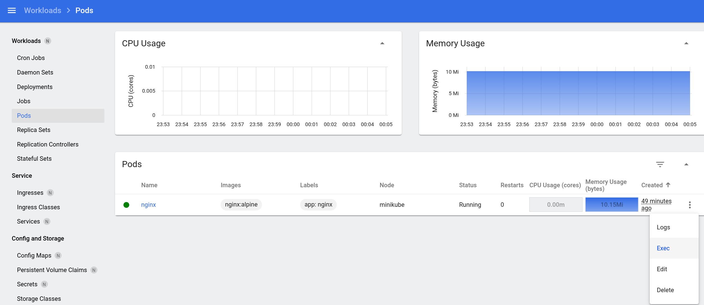

点击这里的exec就可以进入到容器内，还是挺方便的。

```shell
netstat -lntp | grep 80 # 查看80端口是否被占用
```

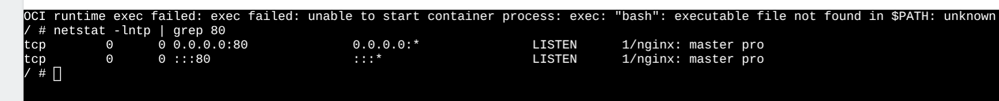

以上步骤一切正常说明minikube能正常工作。

按照kubevirt里的minikube使用示例，启动minikube时需要配一下CNI（container network interface），同时为了方便demo学习，加多一个参数nodes来模拟多个node的情况

```shell
# minikube delete # 删掉之前的cluster实例，如果有
minikube start --nodes=2 --cni=flannel
```

使用以下命令来部署KubeVirt operator，用来管理kubevirt核心组件的生命周期

```shell
export VERSION=$(curl -s https://storage.googleapis.com/kubevirt-prow/release/kubevirt/kubevirt/stable.txt)
echo $VERSION
kubectl create -f "https://github.com/kubevirt/kubevirt/releases/download/${VERSION}/kubevirt-operator.yaml"
```

```shell
# 部署kubevirt
kubectl create -f "https://github.com/kubevirt/kubevirt/releases/download/${VERSION}/kubevirt-cr.yaml"
# 检查是否部署成功，出现Deployed则表示成功部署，如果是Deploying就耐心等等
kubectl get kubevirt.kubevirt.io/kubevirt -n kubevirt -o=jsonpath="{.status.phase}"
```

由于VM比较特殊，kubevirt手册里说还要再装一个virtctl来管理VM。

```shell
VERSION=$(kubectl get kubevirt.kubevirt.io/kubevirt -n kubevirt -o=jsonpath="{.status.observedKubeVirtVersion}")
ARCH=$(uname -s | tr A-Z a-z)-$(uname -m | sed 's/x86_64/amd64/') || windows-amd64.exe
echo ${ARCH}
curl -L -o virtctl https://github.com/kubevirt/kubevirt/releases/download/${VERSION}/virtctl-${VERSION}-${ARCH}
# ps: 这里如果下不下来，直接去github release界面下就行
chmod +x virtctl
sudo install virtctl /usr/local/bin
```

接下来就是真正部署和使用VM了，就不展开了，比较简单。

进到VM里面看一眼内核
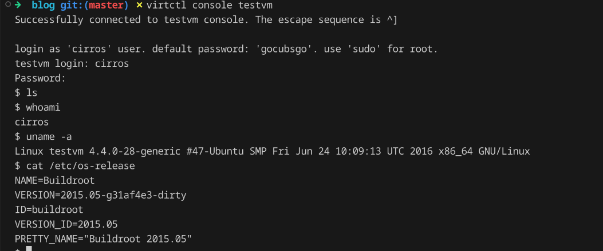

宿主机本身的话是这个
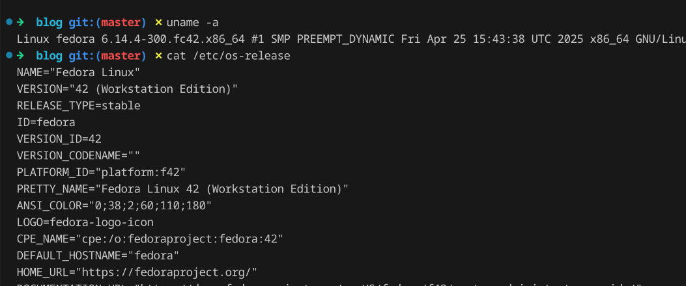

可以看到的确是创建了一个VM

跑起来自然没啥太大难度，接下来就要去看看kubevirt的架构设计，基本的一些概念、术语，基本使用示例，最后再去拉源码看看。

#### KVM、QEMU、容器之间的关系

不过在之前需要先了解一下关于KVM、QEMU以及容器这三者之间的关系。

容器和虚拟机的关系就不提了。提提KVM和QEMU的关系，这两是虚拟机这边的技术。简单检索到了一篇[文章](https://endy-tech.hatenablog.jp/entry/kvm_introduction)，里面是这样介绍KVM和QEMU的关系的。KVM全称Kernel-based Virtual Machine，缩写为KVM，是个内核模块，用来强化对于虚拟化的支持。KVM使用的话有两条件，一是CPU要开启对于虚拟化的支持，Intel家的是VT-X，BIOS里应该是VMX，AMD家的话是AMD-V，也就是SVM；二是内核要加载KVM模块，除非是上古时代的内核，一般都自带。可以用`lsmod | grep kvm` 来查看KVM模块信息。内核的东西嘛，普通用户一般都不会直接用。所以有个libvirt项目，

> libvirt项目提供了用于管理虚拟化平台的 API。libvirt 中的 virsh 是一种命令行实用程序，用于创建、启动、列出和停止虚拟机，以及进入虚拟化 shell。

KVM目前支持的架构主要还是x86,倒也正常。经过简单检索，还是能看到一些KVM和RISC-V的信息，不过在此处暂时不用管，先弄明白在x86下这个KVM和kubevirt之间的关系。

对于更一般的用户来说，libvirt不够直观，可能听到的次数并不多。比如说虚拟机，一提到就是VMware、Virtual-Box、Hyper-V、qemu之类的，（要提一下的是，不久前博通当了把带善人，Vmware对个人免费了）。

qemu是个模拟器，能用来跑虚拟机。模拟器的定义的话还是挺好理解的，比如win上有各式各样的主机模拟器，yuzu模拟器之前不是被任天堂干趴下了。ps4也有模拟器，这些模拟器都可以直接在宿主机上跑。qemu同理，不过qemu一般搭配KVM来一起用，即qemu使用KVM提供的API来增强虚拟机的性能。qemu是跑在用户态下的一个普通的软件，这个普通软件能创建和管理虚拟机。qemu拉起来的虚拟机每个都可以当作一个特殊的进程来看待。（是不是有容器那感觉了，不过还是差挺多的）。

容器基于namespace和cgroup &*%&#*&%*#,容器就不介绍了。这三者的关系差不多就这样。

#### kubevirt架构设计简述

k8s专门用来管理和编排容器。其中有意思的是对于无状态化设计的争论，特别是对于数据库是否应当放进k8s，目前我个人感觉还是不放进去比较好，裸机部署数据库更能发挥数据库的优势。

虚拟机的话本身也有自己的一套编排和管理平台。在云原生时代k8s势不可挡，将虚拟机上的应用改造部署到容器上是目前的趋势。不过虚拟机依旧有其适用面，短期内直接停用虚拟机也不太现实。但是同时维护虚拟机管理平台和k8s平台两套设施的话运维成本过高，所以自然而然就会有使用k8s来管理虚拟机的需求。有需求就会有市场，kubevirt就应运而生。

> KubeVirt 是一个开源项目，让用户能够使用 Kubernetes 作为底层编排平台来运行、部署和管理虚拟机（VM）。在容器内运行虚拟机的流程被称为容器原生虚拟化。KubeVirt 通过将这些虚拟机打包到容器中并从单个控制台管理这两种工作负载，实现了容器原生虚拟化。
>
> 利用 KubeVirt，虚拟机会像在传统虚拟化环境中一样运作，不过它们可以与容器化微服务和云原生应用在同一平台上运行。环境中的所有工作负载（包括虚拟机）都将受益于相同的 Kubernetes 基础架构、工具和管理方式。

容器内跑虚拟机，其实挺好理解的。用qemu/kvm这一套的话，虚拟机本身就是一个特殊的进程，把这个进程丢到容器里面跑也就挺合理的。（~~虚拟机再跑一个k8s，再来一个kubevirt，有点套娃的意味~~）

`调度、网络和存储都委托给 Kubernetes，而 KubeVirt 则提供虚拟化功能。`

贴一下kubevirt的官方架构图

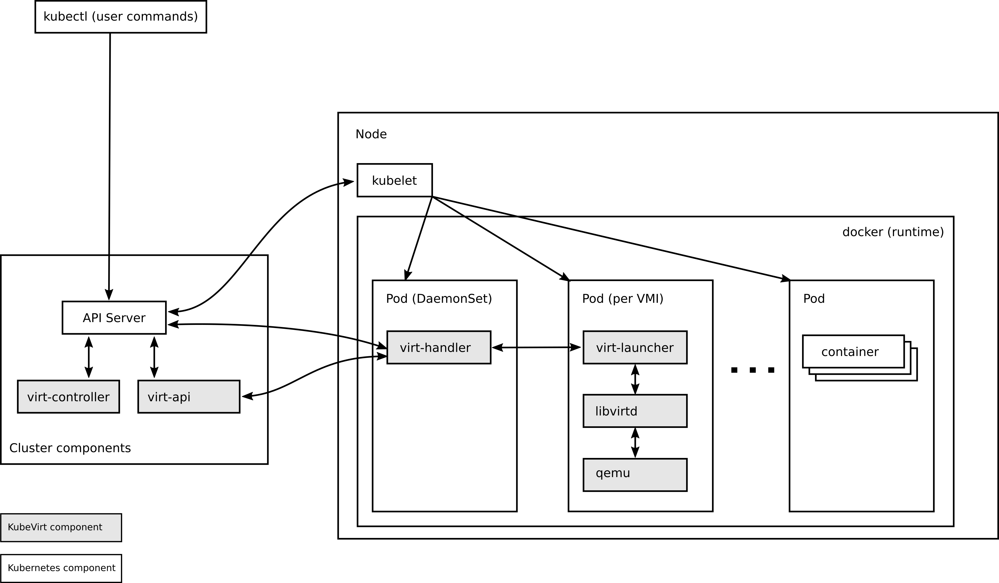

把虚拟机当作Pod来看待，不过虚拟机这个类型在k8s肯定是没有自带的，所以就要用k8s的 Custom Resource Definition (CRD) 来定义咱们的虚拟机类型。有了这个类型，还得要去管理这个类型（有点面向对象的那个感觉，属性+方法）。所以kubevirt还需要实现额外的控制器和守护进程。

在搞定了这些之后，就可以在k8s里面愉快的和虚拟机玩耍了。其中虚拟机的控制器和守护进程是以Pod类似的形式部署在k8s集群上的，也就是不需要单独再去node上安装别的东西。（这样设计还是挺契合k8s的）

还需要介绍两概念，VM（VirtualMachine）和VMI（VirtualMachineInstance），后者可以当作Pod来看待，前者当作spec.replica：1的StatefulSet来看待。二者是1：1对应的关系。

剩下的话，从架构上就没有啥需要额外介绍的了。直接上去看看kubevirt代码，看看是如何拉虚拟机起来的。

#### kubevirt代码学习

说实话，还没接触过这么大规模的代码。阅读源码还是比较有挑战性的。

首先从阅读docs开始，俗话说的好，RTFM。

README中说了kubevirt支持以下几种操作

1. Create a predefined VM
2. Schedule a VM on a Kubernetes cluster
3. Launch a VM
4. Stop a VM
5. Delete a VM

有点CRUD boy的感觉，围绕VM这个资源来进行的操作。那阅读源码的时候就可以依照这个五个方面来，~~闭环、抓手&*%&*%#~~。不过不先不急于看代码，接着看docs。kubevirt用bazel来作为构建系统，在容器内完成构建。用容器来作为构建工具的环境，能确保构建环境的一致性。里面还有一个比较有意思的是，Contributors界面里可以看到commit次数最多的人，第一名是个bot，第二名是来自google的，后面几名都是RedHat的。kubevirt项目文档里大部分的linux distro是fedora也就不难理解了。

Getting-Started里面基本介绍了怎么启动kubevirt，简单配置一下就可以跑起来了。在这些文档里面有几个比较重要的文档，整体架构是一个；具体的组件介绍也很重要；还有一个就是API参考文档。需要着重来看看这个组件介绍，[链接](https://github.com/kubevirt/kubevirt/blob/main/docs/components.md)

里面有个时序图？画的还挺不错，主要介绍了VM的创建和销毁流程。为方便阐述，这里直接贴一下
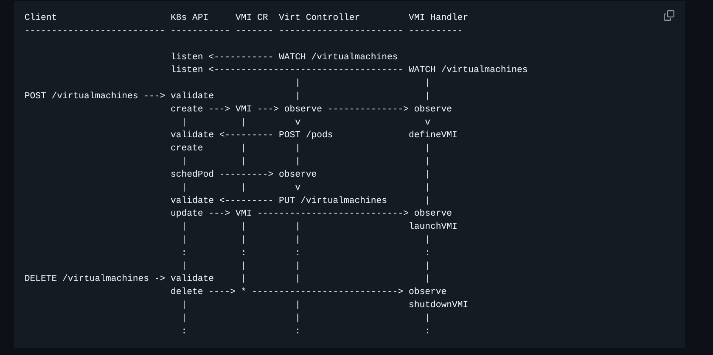

首先来看看这个几个组件，VMI CR，自定义的一个资源类型，定义了VM资源，这个类似于Pod资源本身的定义。我们可以指定使用什么样的Pod，也可以指定使用什么样的VM。Virt Controller，控制器的一种，用来管理VMI的生命周期，和其他控制器一样是属于控制平面的组件，不部署于工作Node上。而handler内部可以作为Daemon Sets来部署，部署在每台Node上，类似于kubelet一样的作用，用来管理本Node上的VM资源。更具体来说，这个handler会给virt-launcher发信号，让launcher来管理VMI，有点像调用docker的API来创建和管理容器。

具体流程的话，图里介绍的还是很清晰的。

下面是创建的流程

1. 客户端说想要拉一个虚拟机起来，kubectl apply -f xxx.yml，里面定义了需要的VM
2. k8s需要校验请求部署的资源是否合法
3. controller准备创建Pod，然后由调度器来调度Pod
4. 当调度完之后，需要更新k8s这个VM对象的状态
5. 之后检查一下配置的虚拟机启动策略，检查是否开机，需要开机就去通知handler
6. 完事

销毁的流程比较简单就不提了。

只需要对照这些流程，一一去查看里面的代码即可，其他的代码就，不出事就先不用理会。那也就是说，回到开源之夏的kubevirt这个项目，要在RISC-V上把上面这套流程给跑通，然后再补点测试样例就可以了。（如同把大象装进冰箱的三步）

但是现在还是不急于去看代码，docs太多了，还得再琢磨一下。

[FAQ](https://github.com/kubevirt/kubevirt/blob/main/FAQ.md)，啪一下，触发关键字了。FAQ必须要看的。里面非常醒目的


这个问题写在了FAQ里面，说明要支持RISC-V还是有挑战性的。不过除了看docs，还得关注这个docs啥时候写的

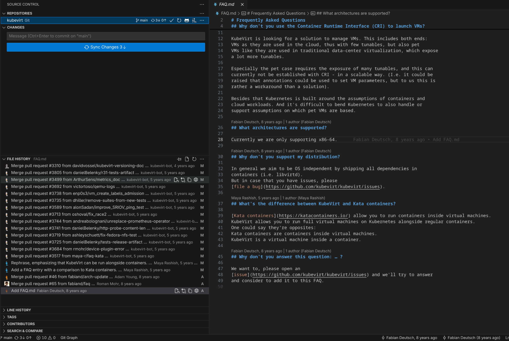

这个FAQ估计没时间维护。还有only support x86-64是8年前说的。问题不大，可以接着往下学习学习kubevirt。

（.wait()，暂时先去尝试一下RISCV架构）

### RISC-V架构

RISC-V最近挺多新闻的。比如fedora这边就有一篇[blog](https://fedoramagazine.org/risc-v-and-fedora-all-aboard/)介绍了fedora对RISC-V架构的支持。（这篇blog其实有个小细节，fedora里面提到了其当前支持了5种架构，Intel/AMD (x86_64), ARM (aarch64), IBM Power (ppc64le), IBM Z (s390x)，以及即将加入的RISC-V，特殊支持IBM这两架构，原因是fedora背后是RedHat，RedHat背后是IBM。在kubevirt的代码里，其中bazel的toolchain里特别支持了s390x架构也就不难理解了）

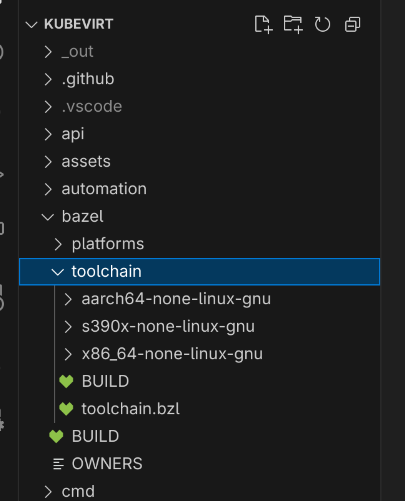

不过话说回来，想尝试尝试RISC-V还不太方便。主流云服务器厂商貌似还没有提供大规模的支持，想像普通x86云服务器一样租用不太行。还是先试试qemu模拟出来的看，如果有必要再去搞个板子裸机部署一个。

#### qemu部署riscv架构的fedora

坦白来说，debian系目前对RISCV支持应该是比较好的。不过我比较习惯fedora，恰好fedora也有一篇[wiki](https://fedoraproject.org/wiki/Architectures/RISC-V/QEMU)介绍怎么使用qemu部署riscv架构的fedora，那就正好按照这篇wiki来本机部署。

```shell
sudo dnf install qemu libvirt -y
sudo systemctl enable libvirtd
sudo systemctl start libvirtd

sudo usermod -a -G libvirt $(whoami) # 允许当前用户管理虚拟机

mkdir -p ~/.config/libvirt && echo 'uri_default = "qemu:///system"' >~/.config/libvirt/libvirt.conf # 配置一下默认的libvirt url

```

环境配置好之后就可以去装虚拟机了，把系统镜像先下好，[链接](https://dl.fedoraproject.org/pub/alt/risc-v/release/42/Cloud/riscv64/images/Fedora-Cloud-Base-Generic-42.20250414-8635a3a5bfcd.riscv64.qcow2)。

```shell
sudo mv Fedora-Cloud-Base-Generic-42.20250414-8635a3a5bfcd.riscv64.qcow2  /var/lib/libvirt/images/fedora-riscv.qcow2 # 把系统镜像移动到libvirt能读取的位置
```

下面需要单独配置一下虚拟机的参数配置，假设放在~/vm里

```shell
mkdir ~/vm
touch ~/vm/user-data.yaml
```

把下面的内容放到~/vm/user-data.yaml
> [!NOTE] 这篇wiki的内容有点问题，原因是那个最新的镜像的链接更新了，使用的cloud init配置要改成以下这个，具体参考[这里](https://cloudinit.readthedocs.io/en/latest/reference/modules.html#set-passwords)

```yaml
#cloud-config
password: fedora
chpasswd: { expire: False }
ssh_pwauth: True
```

最后就可以一键启动虚拟机了

```shell
virt-install \
    --import \
    --name fedora-riscv \
    --osinfo fedora-rawhide \
    --arch riscv64 \
    --cpu mode=maximum \
    --vcpus 4 \
    --ram 4096 \
    --boot uefi \
    --disk path=/var/lib/libvirt/images/fedora-riscv.qcow2 \
    --network default \
    --tpm none \
    --graphics none \
    --controller scsi,model=virtio-scsi \
    --cloud-init user-data=user-data.yaml
```

登陆的话，帐号密码都是fedora

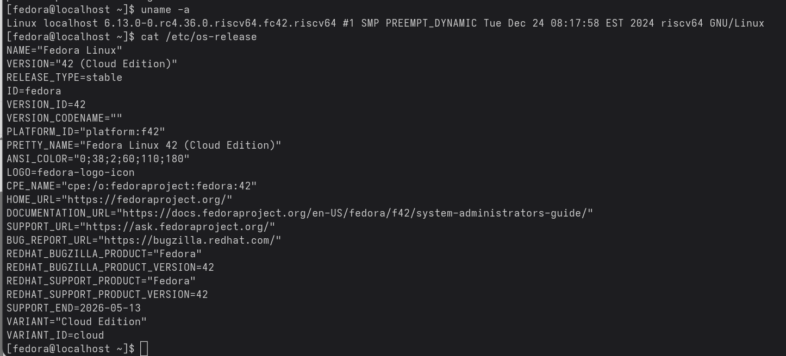

直接这样起来的虚拟机，默认网络是NAT模式，有点小问题，需要~~简单配置一下网络~~。先看看虚拟机能否ping通宿主机，然后再ping一下网关。我发现我的虚拟机能ping通宿主机，ping不通网关，加上宿主机是可以ping通网关的，说明问题出在宿主机对于虚拟机的流量处理上。此时可以不用管虚拟机。

首先来看到宿主机的路由表

```shell
➜  ~ ip route
default via 192.168.1.1 dev enp42s0 proto dhcp src 192.168.1.137 metric 100 
172.17.0.0/16 dev docker0 proto kernel scope link src 172.17.0.1 linkdown 
192.168.1.0/24 dev enp42s0 proto kernel scope link src 192.168.1.137 metric 100 
192.168.122.0/24 dev virbr0 proto kernel scope link src 192.168.122.1
```

最下面的virbr0是libvirt的，路由表没啥问题。接下来就要看看防火墙的配置，其实直接把防火墙关了就结束了😈。但是为了安全（~~增加工作量~~），就得要处理这个麻烦事。核心是iptables的五条链的处理。FORWARD链中我的默认策略是DROP。所以在一开始来自虚拟机的流量没法被转发。于是要在filter表的FORWARD链中添加允许来自 virbr0 接口流量通过的规则 (-i virbr0 -j ACCEPT)。
然后由于我的虚拟机流量要从宿主机的物理网卡出去，就需要在nat表的POSTROUTING链中添加了针对 (192.168.122.0/24)，出去接口为物理网卡 (enp42s0) 的 MASQUERADE 规则 (-s 192.168.122.0/24 -o enp42s0 -j MASQUERADE)。那么去程的路径就通了。最后再在filter表的FORWARD链中添加了 允许 RELATED,ESTABLISHED 状态流量通过的规则 (-m state --state RELATED,ESTABLISHED -j ACCEPT)，这是解决返回流量被阻止的关键。以上就可以在虚拟机正常访问外网了。

简单装一个Go


再装一下docker

```
sudo dnf install docker -y
sudo systemctl enable docker
sudo systemctl start docker
```

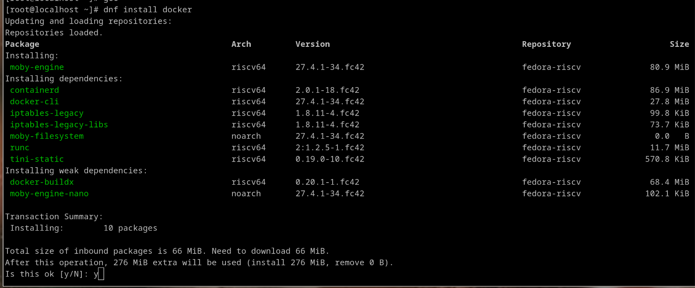

(注意到里面是moby-engine，其实就是docker的开源项目，这个moby和docker社区还不是完全等价。改名其实已经挺久了的，只不过习惯上还是叫他docker)

想pull个image跑一下，发现都没有riscv架构的image

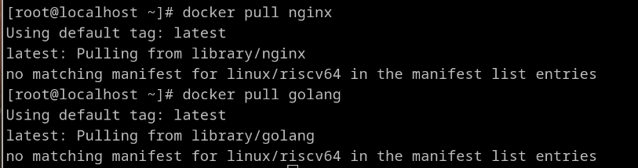

去docker hub看了眼，挺多latest tag的都不支持riscv。alpine支持，干脆拉一个看看

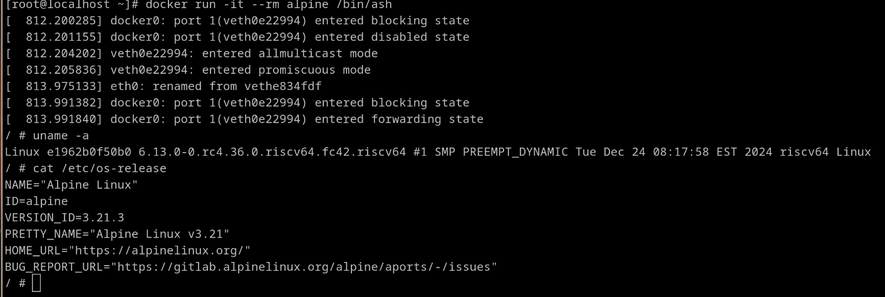

能用，没啥大问题。那接下来就是看看k8s对于riscv的支持程度。本来打算也minikube一键起来，不过去看了一眼发现minikube还不支持riscv，遂作罢。那就试试手动部署k8s集群了。

fedora官方也很详细把如何在fedora中部署k8s集群的方式写出来了，在[这里](https://docs.fedoraproject.org/en-US/quick-docs/using-kubernetes-kubeadm/)。比较简单，就不展开了。记得在root用户下执行就可以了。

不过这样的话，和minikube有点冲突问题，就先把minikube卸掉了。

要把这个riscv虚拟机加入到我本地的k8s集群，然后起一个pod调度到riscv虚拟机这个node里，一切正常的话说明k8s这边适配的很不错。

现在本地k8s集群中有两个节点，一个是fedora x86-64宿主机（下图的第二个），另一个是宿主机用qemu拉起来的riscv虚拟机。
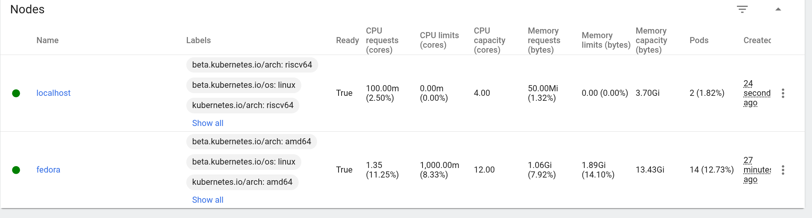

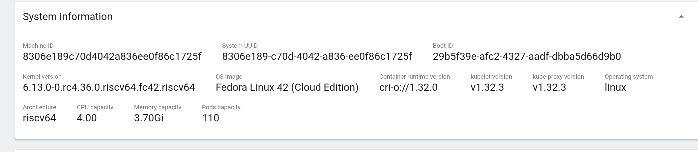
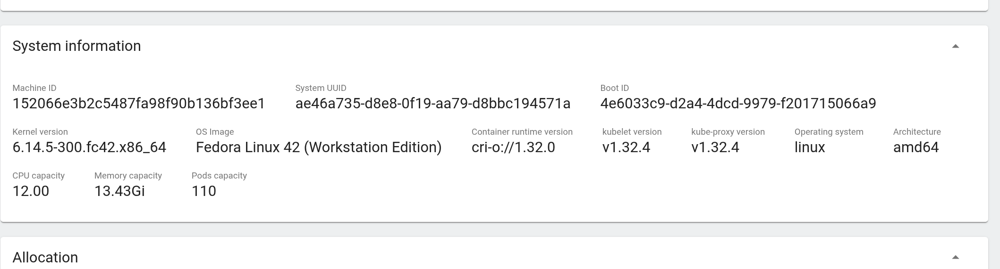

现在尝试调度一个pod至riscv所在的节点。不过现在比较尴尬的是riscv这个节点需要运行flannel，但是又没有对应arch的image，不过暂时可以不管。

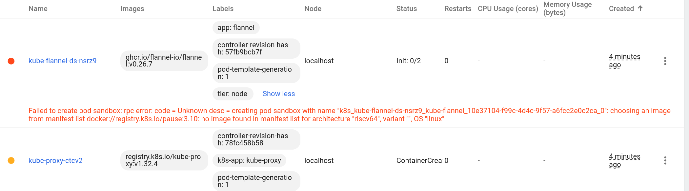

尝试过了alpine:latest支持riscv，所以就决定调度一个alpine的pod到riscv node上。果不其然，支持的还是不是很到位，不过没关系，咱们就是为了解决这些问题才来学习这个项目的。


首先要明确一下现在的情况，riscv node已经加入到集群当中，而且alpine pod已经被调度运行至riscv node。现在卡在pod无法启动，直接原因是registry.k8s.io/pause:3.10不存在riscv架构的image。所以这时候就需要去看看pod的创建流程，才能对症下药。

接下来的操作就比较迷惑了。不过可行，属于是不推荐不支持不赞同不认可的操作。在这种特殊情况下才使用的。

现在短期内的目标是搞定这个最直接的问题，也就是想办法能让这个image存在。那么首先就要了解一下这个image在做什么，站在小白视角，不知道这是啥对吧，没问题，咱们会搜。搜索也要讲究策略，k8s官方文档是肯定要去读的，里面介绍了Pod的基本概念，pod是多个容器的集合，这些容器紧紧耦合在一起，他们之间共享存储和网络。且慢，容器之间是用namespace和cgroup来隔离，那么是怎么共享的呢？我寻思着，以前看到过一些k8s教程，说是再开一个特殊容器，把这些容器都加入到这个特殊容器里，这样就可以实现共享了。继续翻阅k8s对于pod的介绍，直接就是到了init容器的介绍。都没有出现咱们的pause容器这个词，所以要再去看看其他的资料。简单检索得到一篇[教程](https://k8s.iswbm.com/c02/p02_learn-kubernetes-pod-via-pause-container.html#id2)，介绍了pause容器，原来这个pause容器就是这个特殊容器。再琢磨一下教程里其他的内容，了解完这些概念差不多就够用了。

那么回到pause:3.10不存在riscv架构的容器的问题上，直接检索该问题可得一个github [repo](https://github.com/carlosedp/riscv-bringup?tab=readme-ov-file#kubernetes),里面收集了对于riscv支持的情况，其中就包含了对于k8s这些基础image的支持，这个作者单独帮忙制作了riscv下的image，刚好就有pause容器的，而且push到了docker hub上，[链接](https://hub.docker.com/r/carlosedp/pause/tags)。秉承着相信前人的原则，且目前riscv nodes是虚拟机，直接将image拉下来用（**！该操作十分高危，企业用户切勿模仿**）。拉下来之后，一个很自然而然的想法就涌现出来了，直接对这个image打tag，那不就能解决问题了。有想法就要马上实践一下。

由于用的crio来作为容器运行时，对应的默认管理工具crictl没法打tag。装一下podman即可

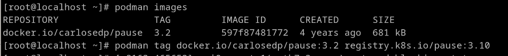

然后给他打个tag指向缺少的image。此时跑去dashboard restart一下对应的deployment。完美启动pod


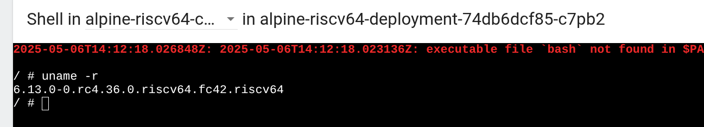

成功实现调度pod到riscv nodes并启动pod。

当然这只是缓兵之计。正确做法应该是什么呢？介绍pause容器的教程里提及了pause容器的源码[链接](https://github.com/kubernetes/kubernetes/blob/master/build/pause/linux/pause.c)，里面的[makefile](https://github.com/kubernetes/kubernetes/blob/master/build/pause/Makefile)明确指出了3.10所支持的架构为 `amd64, arm, arm64, ppc64le and s390x`，所以riscv没有也就能解释的通了。那么我们应该去尝试从这里去构建一个支持riscv的镜像，然后push到docker hub，再去使用自己构建出来的镜像。如果有可能，将这个构建riscv pause容器的支持提个pr，发给了k8s请求合并，这样大家就都能用官方的riscv pause容器了。
