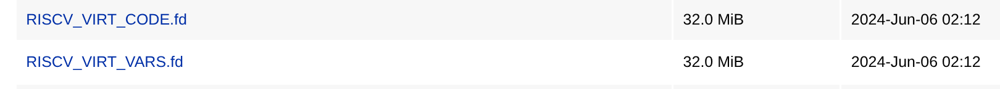

## 下载qemu镜像

需要先下载图里的这两



<https://dl-cdn.openeuler.openatom.cn/openEuler-24.03-LTS/virtual_machine_img/riscv64/>

然后再下载qemu镜像，放在了阿里云盘，有时间限制（阿里云盘的时间限制，仅有1天有效期）

<https://www.alipan.com/t/35GoJzvFarTltufN21JK>

## 启动虚拟机

```shell
qemu-system-riscv64 -machine virt,pflash0=pflash0,pflash1=pflash1,acpi=off -smp 12 -m 4G -blockdev node-name=pflash0,driver=file,read-only=on,filename=RISCV_VIRT_CODE.fd -blockdev node-name=pflash1,driver=file,filename=RISCV_VIRT_VARS.fd -drive file=openEuler-24.03-LTS-riscv64-minIO-and-django.qcow2,format=qcow2,id=hd0,if=none -device virtio-vga -device virtio-rng-device -device virtio-blk-device,drive=hd0,bootindex=1 -device virtio-net-device,netdev=usernet -netdev user,id=usernet,hostfwd=tcp::2222-:22,hostfwd=tcp::9000-:9000,hostfwd=tcp::9001-:9001 -device qemu-xhci -usb -device usb-kbd -device usb-tablet -display none -daemonize
```

## 进入到django

```shell
ssh root@localhost -p 2222 # 密码为 9966
su emt
cd ~/django # 里面即为适配过程所使用的环境
ls -l ./dist # 查看构建出来的whl
```

## 进入到minIO

```shell
ssh root@localhost -p 2222 # 密码为 9966
su emt
cd ~/minio # 里面即为适配所使用的环境

file ./minio

./minio --version


./minio server ~/data # 启动minio
```
