# django-5.2 适配 riscv64 环境

## 适配对象

Django 5.2, Github Repo -> [链接](https://github.com/django/django/tree/5.2)

## 适配目标

能在openEuler的RISCV64环境跑起来。

## 适配过程

做适配工作什么的，说实话以前没接触过。不过适配目标是明确的，在RV上跑起来。所以没有疑问，按照启动django项目的流程走一波，出什么问题就解决什么问题。

先看看python环境

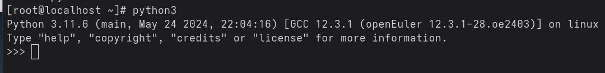

嗯，有一个python环境。直接pip install django，看看怎么说。

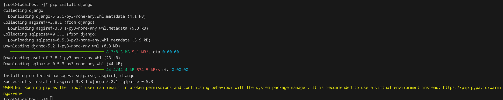

出乎意料的顺利？。安装的django版本为`5.2.1`，和要求的版本`5.2`不一致，重新安装一下，带上指定版本号。`pip uninstall django`即可。

```shell
pip install django==5.2
```

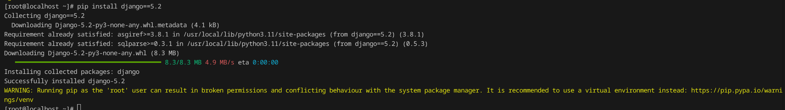

版本对上了。接下来启动一个django项目看看什么情况。之前django玩挺多，现在是忘挺多。打开官网得到一个对应的版本的quick start, [链接](https://docs.djangoproject.com/en/5.2/intro/tutorial01/)，按图索骥。

1. 确定装了django
```shell
python -m django --version
# output: 5.2
```

2. 创建项目

```shell
mkdir djangotutorial
django-admin startproject mysite djangotutorial
```
顺利的话，啥输出都没有。

ls看看创建出来的文件夹  
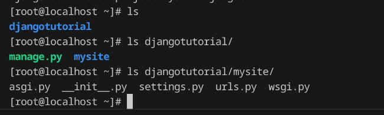

没啥问题

3. 启动项目
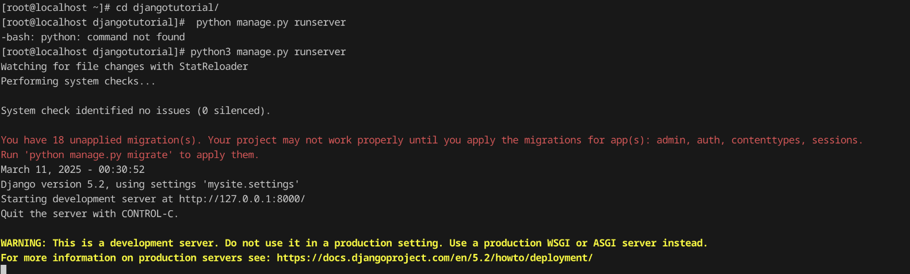

顺利起来了，再起一个终端curl看看结果。

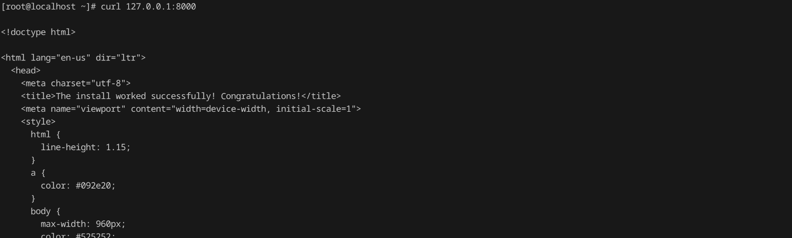

一切顺利。

说明官方对于RV64的支持很到位，官方给出的包大体上能跑通。

那适配工作就算结束了？才刚刚开始。注意到项目里提到的软件适配过程要求，需要完成源码级构建。那就需要把5.2版本的Django源码拉到openEuler中，然后开始构建。同时需要注意一个细节，我们刚才装的django那个包名全称是Django-5.2-py3-none-any.whl，那么一般来说这里其实会指出支持linux、win之类，还有限定的指令集架构，这里没有，整了个any。这时候得跑去pypi看一眼什么情况。

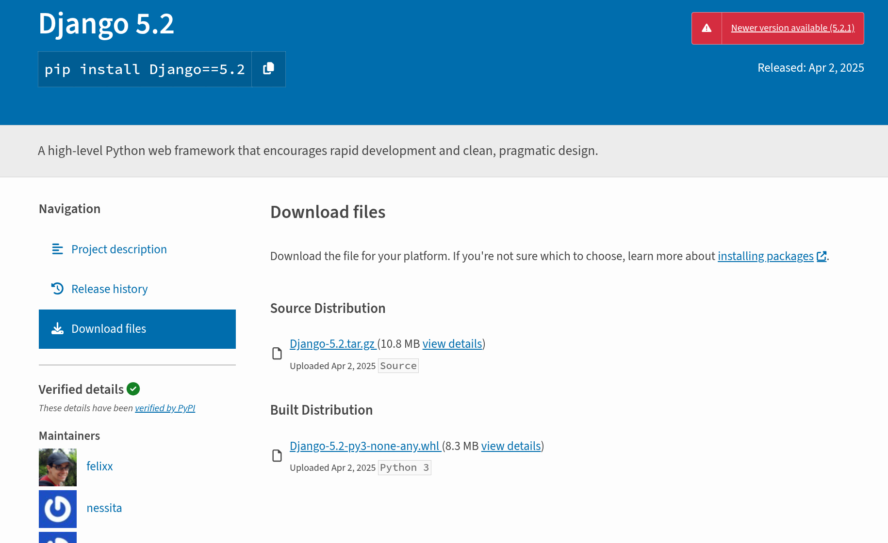

可以看到5.2仅发布了一个any包，说明应该没啥令人头痛的兼容问题，我们可以大胆去跑一把本地源码构建，本地弄一个RV64下的包，然后装到环境里，按照上面的流程再来一次。如果一切**顺利**，再另说。

接下来就要去拉源码了。

需要装一下git
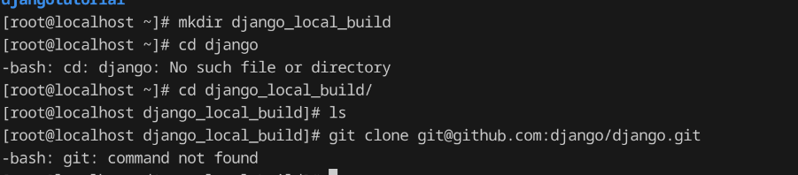

```shell
dnf install git -y
```

dnf/yum都可以，和小红帽一样。

然后配一下github 拉取的密钥，比较简单。偷懒的话`ssh-keygen`生成一个新的，再把公钥丢到github就行。不想配也行，走https拉吧。

本来打算vscode远程进去到里面，发现vscode不支持RV64,遂作罢，就命令行，慢慢敲吧。

现在预期是从源码构建出pip的包，得找一下pypi的打包教程，简单检索可得,[链接](https://packaging.python.org/en/latest/tutorials/packaging-projects/)。

1. 安装打包工具

```shell
python3 -m pip install --upgrade build
```
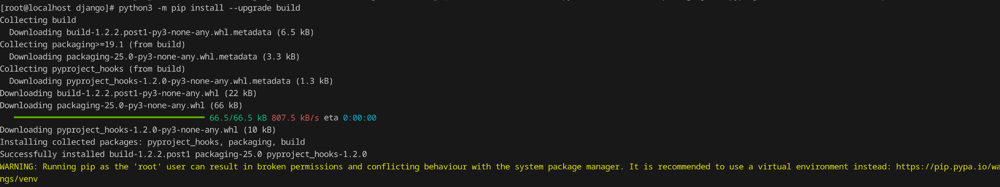

2. 打包

```shell
python3 -m build
```

比较耗时，耐心等等
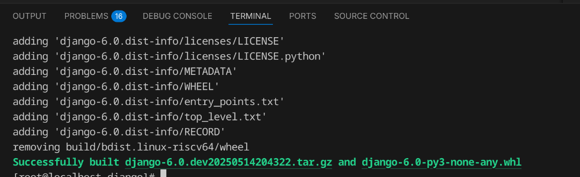

git忘记切换版本了，`git check 5.2`，再重新构建。

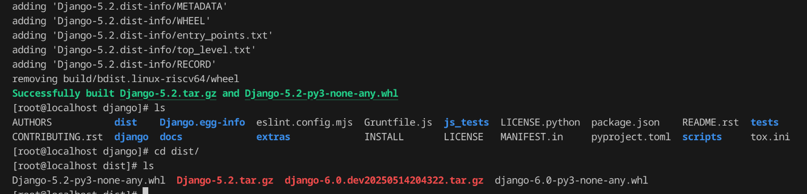

轮子已经构建完了，接下来尝试装到本地，然后跑一趟之前的测试。

（题外话
openeuler的这个qemu虚拟机时间不太对，可以这样来调整,
```shell
timedatectl set-timezone "Asia/Shanghai" # 改时区
dnf install chrony -y
systemctl start chronyd
chronyc makestep # 显示200即可同步时间
```
）

先把之前通过pip install的django5.2 uninstall掉。然后指定安装刚才构建出来的whl即可
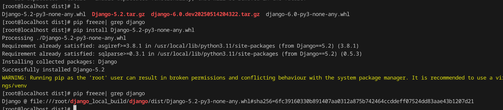

可以看到顺利安装成功了。接下来再走一次一开始的测试流程。经过测试同样是没有问题，说明能在RV64上顺利构建并正常运行。

感觉有点不太正常。现在来回顾一下，是否有哪些地方缺失了。注意到django项目内有tests文件夹，那就顺便跑一把看看。

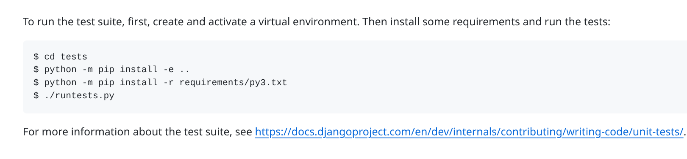

```shell
cd tests
python3 -m pip install -e ..
python3 -m pip install -r requirements/py3.txt
./runtests.py
```

总算是报了点错，具体是在装依赖的时候，里面有一个numpy-2.2.5报了错。

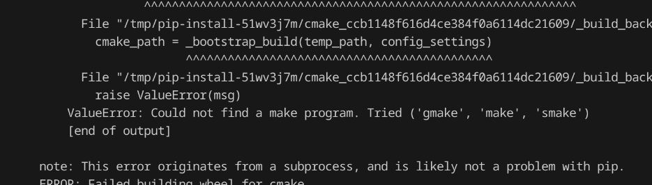

比较简单，装一个make看看。

```shell
dnf install make -y
```

毫无疑问，依旧有报错，变成了下面这个。
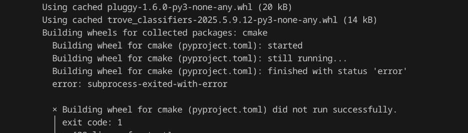

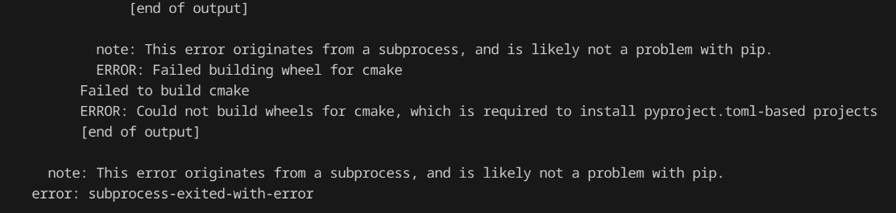
报错信息还是比较清晰的，cmake这个whl构建不出来，再往上查找一下日志可以看到这个
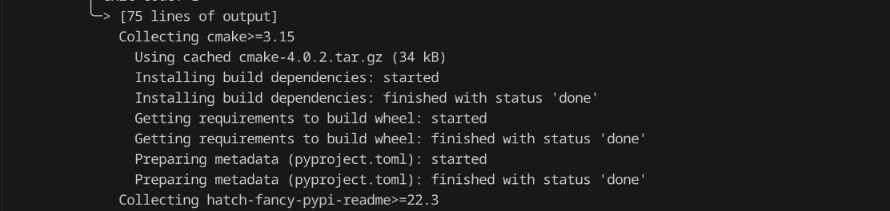
预期是使用>=3.15即可，然后这里使用了4.0.2。这里尝试一下直接指定用3.15。
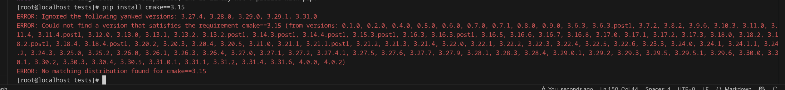
改用最近的3.16.3.
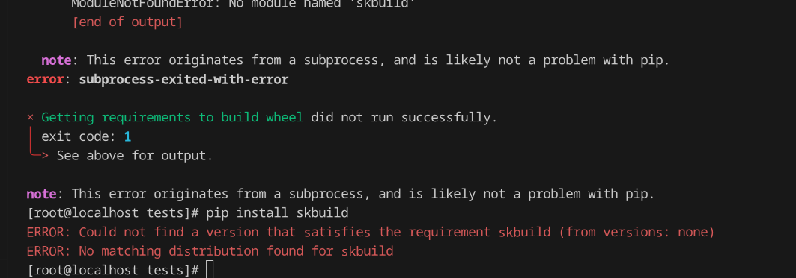
又报新的错。这样下去不行。

cmake的话，试试看dnf能否装。

```shell
dnf install cmake -y
```

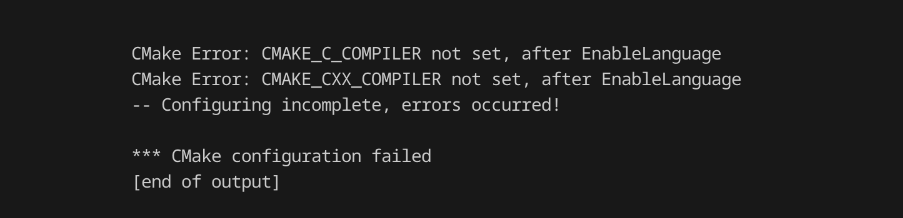

缺啥装啥，这里应该缺gcc和g++

```shell
dnf install gcc g++ -y
```
编译了老半天，cpu能吃满。然后还是无情报错。

新的报错如下
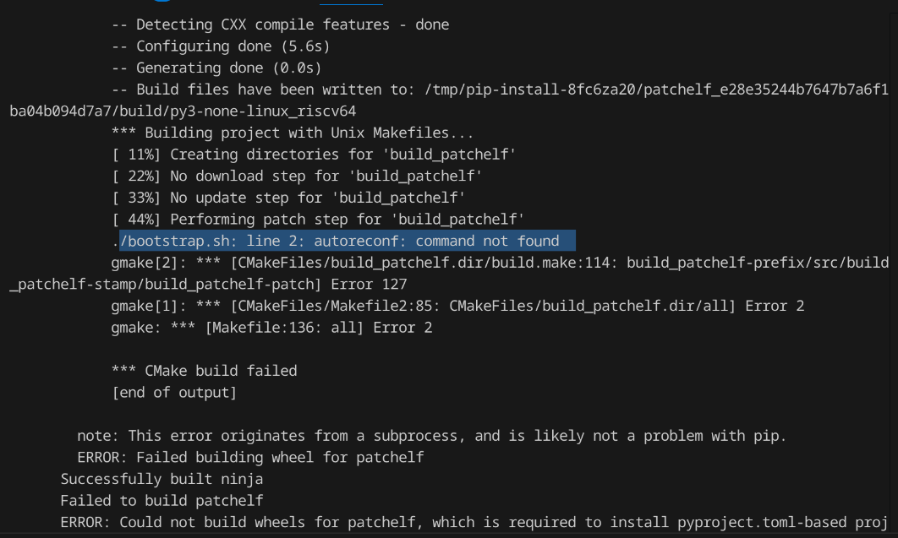

可以看到是在patchelf这个包的问题，里面的bootstrap.sh第二行用了一个autoreconf，报找不到。简单检索可得，安装autoconf即可。

```shell
dnf install autoconf -y
```

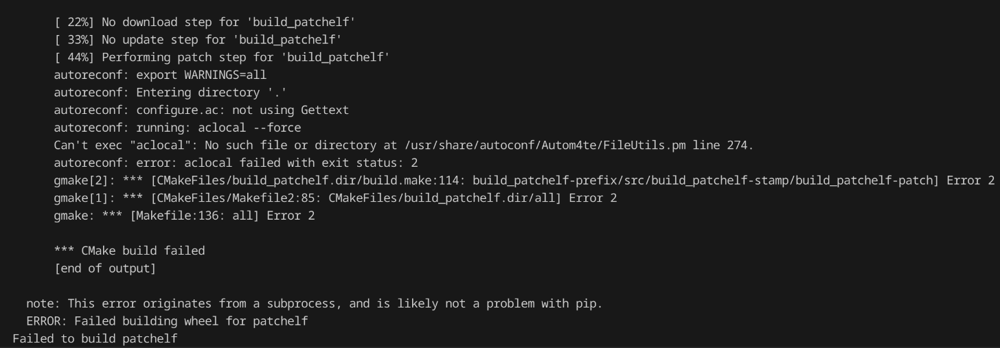
再次检索可得，需要安装automake

```shell
dnf install automake -y
```

整体的阶段从卡在installing backend dependcies到了preparing metadata。

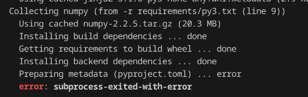

具体是以下这个报错

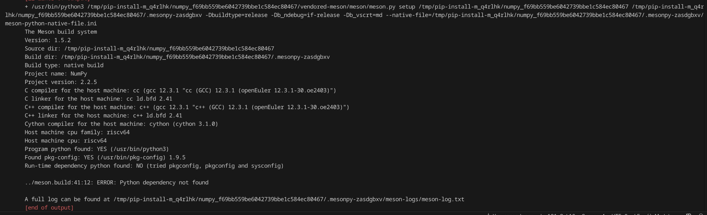

里面有个日志，我们去捞一下看看。cat一下，发现已经无了。那好吧，同样是去检索互联网可得，需要安装python3-devel。

```shell
dnf install python3-devel -y
```

其实这些报错都可以避免的，因为C和Pypi的包构建对这些都是必需的。也许可以在build之前检查有无这些，不然卡老半天报错再来解决。不过实现起来当然也是无比复杂的。

经典CPU吃满
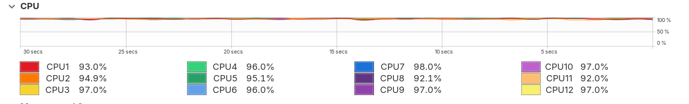

经过约摸半小时的构建，numpy成功装上。当然，少不了新的报错。

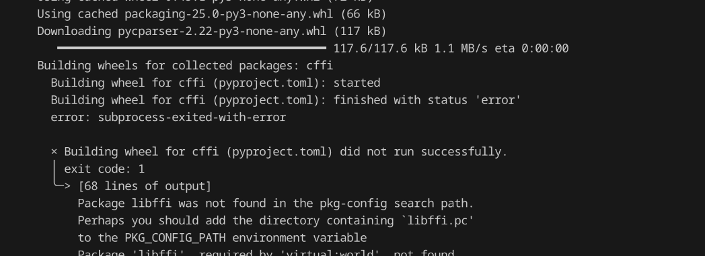

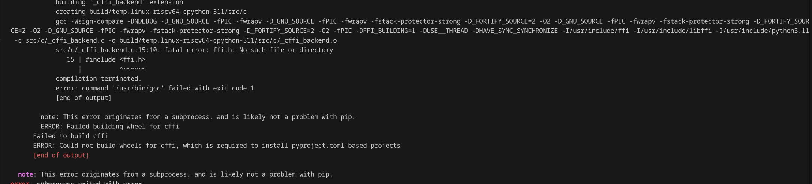

同样，缺什么装什么

```shell
dnf install libffi-devel -y
```

新的报错 1

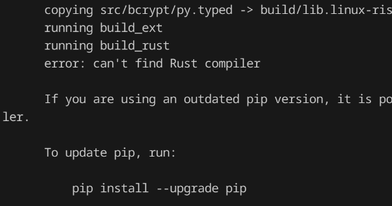

日志给出的依赖要求

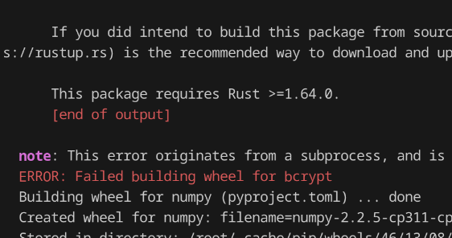

新的报错 2

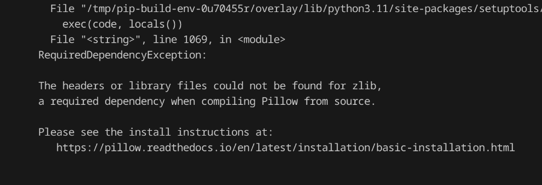

新的报错 3

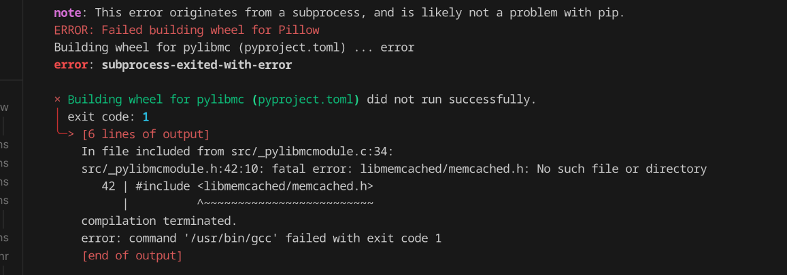

依次解决
```shell
dnf install rustc zlib-devel libmemcached-devel -y
```

新的报错 1 
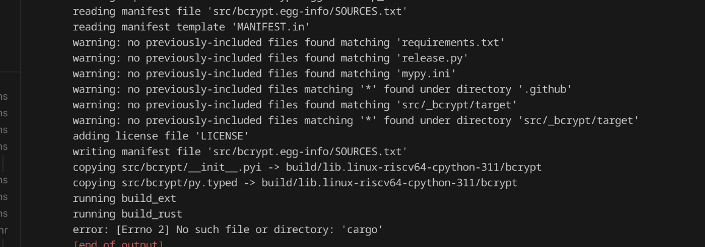

新的报错 2
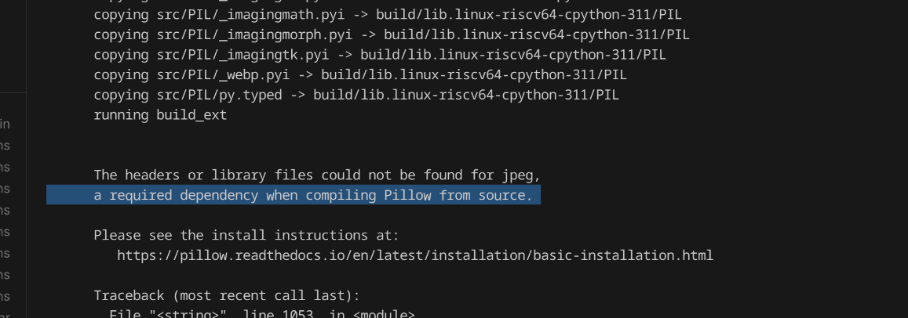

```shell
dnf install libjpeg-devel cargo -y
```


最终圆满装上

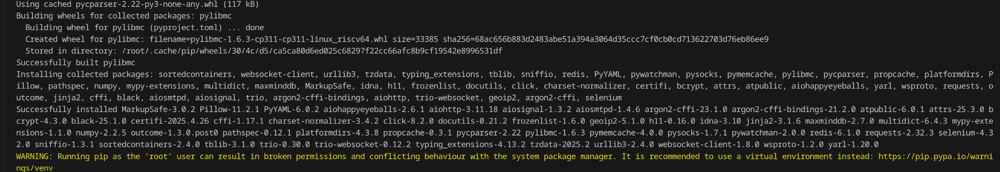

然后就可以开始跑测试了

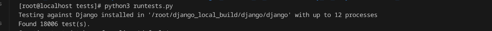