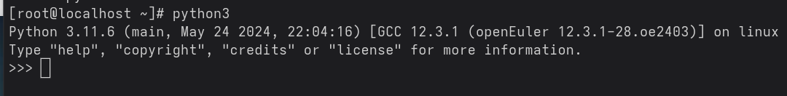
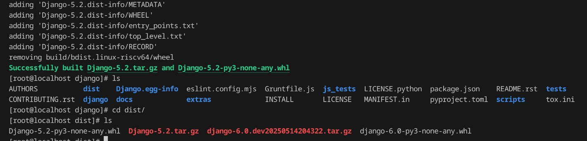
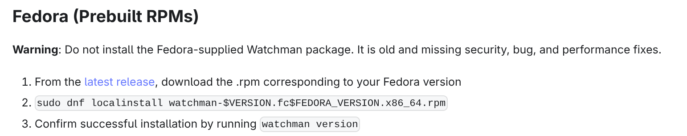

# django-5.2 适配 riscv64 环境

## 适配对象

Django 5.2, Github Repo -> [链接](https://github.com/django/django/tree/5.2)

## 适配目标

能在openEuler的RISCV64环境跑起来。

## 适配过程

做适配工作什么的，说实话以前没接触过。不过适配目标是明确的，在RV上跑起来。所以没有疑问，按照启动django项目的流程走一波，出什么问题就解决什么问题。

先看看python环境



嗯，有一个python环境。直接pip install django，看看怎么说。


出乎意料的顺利？。安装的django版本为`5.2.1`，和要求的版本`5.2`不一致，重新安装一下，带上指定版本号。`pip uninstall django`即可。

```shell
pip install django==5.2
```


版本对上了。接下来启动一个django项目看看什么情况。之前django玩挺多，现在是忘挺多。打开官网得到一个对应的版本的quick start, [链接](https://docs.djangoproject.com/en/5.2/intro/tutorial01/)，按图索骥。

1. 确定装了django

```shell
python -m django --version
# output: 5.2
```

2. 创建项目

```shell
mkdir djangotutorial
django-admin startproject mysite djangotutorial
```

顺利的话，啥输出都没有。

ls看看创建出来的文件夹  


没啥问题

3. 启动项目


顺利起来了，再起一个终端curl看看结果。


一切顺利。

说明官方对于RV64的支持很到位，官方给出的包大体上能跑通。

那适配工作就算结束了？才刚刚开始。注意到项目里提到的软件适配过程要求，需要完成源码级构建。那就需要把5.2版本的Django源码拉到openEuler中，然后开始构建。同时需要注意一个细节，我们刚才装的django那个包名全称是Django-5.2-py3-none-any.whl，那么一般来说这里其实会指出支持linux、win之类，还有限定的指令集架构，这里没有，整了个any。这时候得跑去pypi看一眼什么情况。


可以看到5.2仅发布了一个any包，说明应该没啥令人头痛的兼容问题，我们可以大胆去跑一把本地源码构建，本地弄一个RV64下的包，然后装到环境里，按照上面的流程再来一次。如果一切**顺利**，再另说。

接下来就要去拉源码了。

需要装一下git


```shell
dnf install git -y
```

dnf/yum都可以，和小红帽一样。

然后配一下github 拉取的密钥，比较简单。偷懒的话`ssh-keygen`生成一个新的，再把公钥丢到github就行。不想配也行，走https拉吧。

本来打算vscode远程进去到里面，发现vscode不支持RV64,遂作罢，就命令行，慢慢敲吧。

现在预期是从源码构建出pip的包，得找一下pypi的打包教程，简单检索可得,[链接](https://packaging.python.org/en/latest/tutorials/packaging-projects/)。

1. 安装打包工具

```shell
python3 -m pip install --upgrade build
```


2. 打包

```shell
python3 -m build
```

比较耗时，耐心等等


git忘记切换版本了，`git check 5.2`，再重新构建。



轮子已经构建完了，接下来尝试装到本地，然后跑一趟之前的测试。

（题外话
openeuler的这个qemu虚拟机时间不太对，可以这样来调整,

```shell
timedatectl set-timezone "Asia/Shanghai" # 改时区
dnf install chrony -y
systemctl start chronyd
chronyc makestep # 显示200即可同步时间
```

）

先把之前通过pip install的django5.2 uninstall掉。然后指定安装刚才构建出来的whl即可


可以看到顺利安装成功了。接下来再走一次一开始的测试流程。经过测试同样是没有问题，说明能在RV64上顺利构建并正常运行。

感觉有点不太正常。现在来回顾一下，是否有哪些地方缺失了。注意到django项目内有tests文件夹，那就顺便跑一把看看。


```shell
cd tests
python3 -m pip install -e ..
python3 -m pip install -r requirements/py3.txt
./runtests.py
```

总算是报了点错，具体是在装依赖的时候，里面有一个numpy-2.2.5报了错。


比较简单，装一个make看看。

```shell
dnf install make -y
```

毫无疑问，依旧有报错，变成了下面这个。


报错信息还是比较清晰的，cmake这个whl构建不出来，再往上查找一下日志可以看到这个


预期是使用>=3.15即可，然后这里使用了4.0.2。这里尝试一下直接指定用3.15。


改用最近的3.16.3.


又报新的错。这样下去不行。

cmake的话，试试看dnf能否装。

```shell
dnf install cmake -y
```


缺啥装啥，这里应该缺gcc和g++

```shell
dnf install gcc g++ -y
```

编译了老半天，cpu能吃满。然后还是无情报错。

新的报错如下


可以看到是在patchelf这个包的问题，里面的bootstrap.sh第二行用了一个autoreconf，报找不到。简单检索可得，安装autoconf即可。

```shell
dnf install autoconf -y
```


再次检索可得，需要安装automake

```shell
dnf install automake -y
```

整体的阶段从卡在installing backend dependcies到了preparing metadata。


具体是以下这个报错


里面有个日志，我们去捞一下看看。cat一下，发现已经无了。那好吧，同样是去检索互联网可得，需要安装python3-devel。

```shell
dnf install python3-devel -y
```

其实这些报错都可以避免的，因为C和Pypi的包构建对这些都是必需的。也许可以在build之前检查有无这些，不然卡老半天报错再来解决。不过实现起来当然也是无比复杂的。

经典CPU吃满


经过约摸半小时的构建，numpy成功装上。当然，少不了新的报错。


同样，缺什么装什么

```shell
dnf install libffi-devel -y
```

新的报错 1


日志给出的依赖要求


新的报错 2


新的报错 3


依次解决

```shell
dnf install rustc zlib-devel libmemcached-devel -y
```

新的报错 1


新的报错 2


```shell
dnf install libjpeg-devel cargo -y
```

最终圆满装上


下面可以看到本地build出来的wheel

```shell
[root@localhost wheels]# find /root/.cache/pip -name '*riscv64.whl'
/root/.cache/pip/wheels/6f/5a/c0/4b0c781fcffcafdf2fc0a565fe9ea4f34e43c133730da3dec2/pywatchman-2.0.0-cp311-cp311-linux_riscv64.whl
/root/.cache/pip/wheels/dc/6c/a5/9ba95fb773ed63f6f36779baf2612931788b74bb3a789d1f62/pillow-11.2.1-cp311-cp311-linux_riscv64.whl
/root/.cache/pip/wheels/bb/96/19/f031a7d18951d458b7c123d62233433a73d0b822998aff4ec3/aiohttp-3.11.18-cp311-cp311-linux_riscv64.whl
/root/.cache/pip/wheels/9d/38/99/1f61f3b0dd7ab4898edfa9fcf6feb13644d4d49a44b3bed19d/markupsafe-3.0.2-cp311-cp311-linux_riscv64.whl
/root/.cache/pip/wheels/cd/ac/c1/ba4b4a441600cf3c279a8c9db8b9410257940ff0070afbc563/bcrypt-4.3.0-cp311-cp311-linux_riscv64.whl
/root/.cache/pip/wheels/b8/18/c9/a87b7ef403a539e29b302a26cef15c8aff336e7799119bb678/argon2_cffi_bindings-21.2.0-cp311-abi3-linux_riscv64.whl
/root/.cache/pip/wheels/46/13/08/d66f9dc6f40c34aac7798117fba8b1ad26d79513bb86084658/numpy-2.2.5-cp311-cp311-linux_riscv64.whl
/root/.cache/pip/wheels/02/bc/f2/ad34347005242bda2343c81a0fc1ab4f44c5311f8d95c0e26b/pyyaml-6.0.2-cp311-cp311-linux_riscv64.whl
/root/.cache/pip/wheels/04/67/73/d6174de8ad751cfe8c9f3bde5ce2e380df3747f34aecad5482/cffi-1.17.1-cp311-cp311-linux_riscv64.whl
/root/.cache/pip/wheels/f3/ff/83/4da306ed00f7693fddee5a6ad63b613323cd3df5a96ca7982a/patchelf-0.17.2.2-py3-none-linux_riscv64.whl
/root/.cache/pip/wheels/5b/3a/bc/7778426961fe5866cb7fd6351f6d0d43aea7cd9d850e7207ba/ninja-1.11.1.4-py3-none-linux_riscv64.whl
/root/.cache/pip/wheels/30/4c/d5/ca5ca80d6ed025c68297f22cc66afc8b9cf19542e8996531df/pylibmc-1.6.3-cp311-cp311-linux_riscv64.whl
/root/.cache/pip/wheels/5e/4e/8a/b085e41fe066c4096aa0780b5fd2501484271fe9b8e1ee1cf3/maxminddb-2.7.0-cp311-cp311-linux_riscv64.whl
```

然后就可以开始跑测试了


跑了快一个小时，4G内存吃完了就不动了。把主机内存全给他吃吧。

卡着不动的具体表现是如下图，python3陷入了sleep，但是等待许久依旧不动。


和死锁差不多了。看到这里我想起一个笑话，说chromium的开发者都人均64G内存的开发机，所以压根感受不出来小内存情况下chrome存在的内存占用问题。咱们当然没有这么富裕的内存，首先尝试开一下swap，开个8G看看效果。

参考此处，[链接](https://zhuanlan.zhihu.com/p/106327686)

```shell
dd if=/dev/zero of=/swapfile count=8192 bs=1M
chmod 600 /swapfile
mkswap /swapfile
swapon /swapfile

# 在/etc/fstab的最后一行添加这个
# /swapfile none swap sw 0 0
```

初次跑完了test，结果如下

```plain
Ran 18004 tests in 2849.646s

FAILED (failures=3, skipped=1298, expected failures=5)
```

具体是以下三个挂了

```plain
FAIL: test_permissions_error (template_tests.test_loaders.FileSystemLoaderTests.test_permissions_error)
----------------------------------------------------------------------
AssertionError: PermissionError not raised
======================================================================
FAIL: test_readonly_root (file_uploads.tests.DirectoryCreationTests.test_readonly_root)
Permission errors are not swallowed
----------------------------------------------------------------------
AssertionError: PermissionError not raised
======================================================================
FAIL: test_no_write_access (i18n.test_compilation.PoFileTests.test_no_write_access)
----------------------------------------------------------------------
AssertionError: CommandError not raised
```

初步判断可能是因为我用root用户来跑的，改用一个普通用户跑跑看。跑一次2800多s，太耗时了。

```plain
FAIL: test_strip_tags_files (utils_tests.test_html.TestUtilsHtml.test_strip_tags_files) [<object object at 0x3f752c0a20>] (filename='strip_tags1.html')
----------------------------------------------------------------------
Traceback (most recent call last):
  File "/usr/lib64/python3.11/unittest/case.py", line 57, in testPartExecutor
    yield
  File "/usr/lib64/python3.11/unittest/case.py", line 538, in subTest
    yield
  File "/home/emt/django/tests/utils_tests/test_html.py", line 171, in test_strip_tags_files
    self.assertEqual(elapsed.seconds, 0)
    ^^^^^^^^^^^^^^^^^
  File "/usr/lib64/python3.11/unittest/case.py", line 873, in assertEqual
    assertion_func(first, second, msg=msg)
    ^^^^^^^^^^^^^^^^^
  File "/usr/lib64/python3.11/unittest/case.py", line 866, in _baseAssertEqual
    raise self.failureException(msg)
    ^^^^^^^^^^^^^^^^^
AssertionError: 1 != 0

----------------------------------------------------------------------
Ran 18004 tests in 2634.286s

FAILED (failures=1, skipped=1298, expected failures=5)
```

去看了一下源码，具体是下面这里

```python
def test_strip_tags_files(self):
    # Test with more lengthy content (also catching performance regressions)
    for filename in ("strip_tags1.html", "strip_tags2.txt"):
        with self.subTest(filename=filename):
            path = os.path.join(os.path.dirname(__file__), "files", filename)
            with open(path) as fp:
                content = fp.read()
                start = datetime.now()
                stripped = strip_tags(content)
                elapsed = datetime.now() - start
            self.assertEqual(elapsed.seconds, 0)
            self.assertIn("Test string that has not been stripped.", stripped)
            self.assertNotIn("<", stripped)
```

这两都是长文本，解析耗时超过1s了，所以导致抛出了异常。估计和我的机子也有点关系，CPU是AMD的5600G，按说不算太古老，我猜测可能的原因有两，一是虚拟机本身IO上不来，性能也有所损耗，二是我开了swap，缺页太多可能导致性能下降较为严重。主要是后者，不过这个问题不大，都用django了，性能下去一点是正常现象。

咱们来重新指定这个FAIL的测试再跑一次，看看结果如何，就暂时不跑全量的。

```shell
python3 runtests.py utils_tests

# 结果如下
# Ran 638 tests in 13.252s
# 
# OK (skipped=20)

```

成功通过，说明只是个偶然的性能问题。我又多跑了3次，均没有问题。那么现在就需要来处理最棘手的一部分内容了。skipped部分的测试，skip不意味着测试通过，只是意味着跳过。

> While Django's test suite is running, you'll see a stream of characters
representing the status of each test as it completes. ``E`` indicates that an
error was raised during a test, and ``F`` indicates that a test's assertions
failed. Both of these are considered to be test failures. Meanwhile, ``x`` and
``s`` indicated expected failures and skipped tests, respectively. Dots indicate
passing tests.
>
> Skipped tests are typically due to missing external libraries required to run
the test; see :ref:`running-unit-tests-dependencies` for a list of dependencies
and be sure to install any for tests related to the changes you are making (we
won't need any for this tutorial). Some tests are specific to a particular
database backend and will be skipped if not testing with that backend. SQLite
is the database backend for the default settings. To run the tests using a
different backend, see :ref:`running-unit-tests-settings`.

从我们上面几次的结果可以看到，skip的还是挺多的，我们可以细细琢磨一下那些skip的。django官方说tests应当是全部pass。我们这次适配的目标的话就争取尽可能达成该目标。

首先我们按照上面提到的，有一个全部依赖，我们去装一下全部依赖，然后再来一次全量测试。具体的django给出的python包依赖在[这里](https://docs.djangoproject.com/en/5.2/internals/contributing/writing-code/unit-tests/#running-all-the-tests)。

主要有以下几个

1. tests/requirements/py3.txt
2. 如果您想测试 memcached 或 Redis 缓存后端，您还需要CACHES分别定义指向 memcached 或 Redis 实例的设置。
2. 要运行 GeoDjango 测试，您需要设置空间数据库并安装地理空间库。
4. 要运行一些自动重新加载测试，您需要安装 Watchman 服务。

这些依赖项都是可选的。如果缺少任何一个，相关的测试将被跳过。

上面这些内容来自django官网。我们已经达成了1.接下来折腾一下2、3、4。

首先搞一个memcached，

```shell
dnf install memcached -y
systemctl enable --now memcached
```

然后去配置一下使得跑测试的时候能用上我们的memcached。在`tests/test_sqlite.py`里加上这个

```python
CACHES = {
    "default": {
        "BACKEND": "django.core.cache.backends.memcached.PyMemcacheCache",
        "LOCATION": "127.0.0.1:11211",
    }
}
```

图数据库安装看起来比较麻烦，留到最后再看看。现在来直接配置一下Watchman。



有点搞，说fedora官方的Watchman过老。那我们简单手动操作一下，后续再写脚本一键起来。下载解压运行，报错。watchman官方给出来的包只有x86-64的。而watchman本身是多语言混合写的，在RV上编译的话工作量还是不小的，暂且搁置吧。

先试试在添加了memcached的情况下，skip数量是否会减少。

```plain
Ran 18004 tests in 3061.033s

FAILED (failures=2, skipped=1240, expected failures=5)
```

skipped的稍微减少了一点。但大部分并没有减少。（挂的这两个是因为时间问题，修正一下时间重跑就能过了）

重跑一遍，需要事先把测试结果保存下来。翻看了半天的runtests.py没太找着保存结果的参数配置，干脆收集命令行全部输出得了。

```python
python3 runtests.py --keepdb -v 2 &> testoutput.txt
```

通过对结果的初步分析，可以看到大部分是针对某些特定数据库的测试样例，比如针对pgsql、oracel的，还有的是针对浏览器需要浏览器来进行测试的，由于我是跑在虚拟机里面的，为其配备浏览器的操作过于复杂，暂且可以搁置。

此时跑去看github action上，django正常情况下的测试结果。

<https://github.com/django/django/actions/workflows/tests.yml>

下载最近的运行测试的结果，发现正常情况下也没有配置额外的数据库，都是用sqlite来跑，skipp大概也都在1400左右，说明django在RV的测试基本上算是通过的。

## 适配结论

在RV环境下，django 5.2不需要做出额外的修改，pip install django即可开箱即用。即使是在RV环境下，从源码开始构建出的whl也能正常工作，和x86、arm下运行的测试结果无差异。主要原因为django为纯python实现，指令集架构这些底层的细节对于django来说是透明，django直接面向的是python解释器，如果需要利用RV的特殊指令集来对django做加速之类的操作，可能会不太好合入django项目。
