# 记录第二期傲来操作系统（EulixOS）训练营的实践内容

## 1.这是啥

一个以RISC-V为主的操作系统精简版教程。学习曲线相对平缓。

按照介绍来看，目前是第二期。第二期的主要方向如下
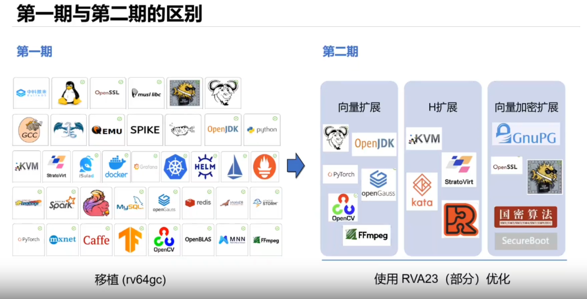

其中具体内容如下
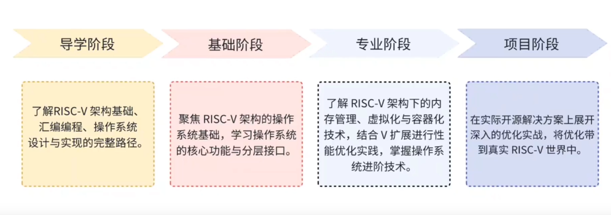

按照上图里来看，分为了4个阶段，后续就按顺序来操作即可。

## 2. 实践过程

### 1. 导学阶段

b站视频，直接2倍速起飞看。还是很有意思的，前面主要是计组青春版+OS部分内容+编译原理部分内容。经历过计组用AHDL手搓指令实现，看这个教程就比较友好了。

配置环境的话，实测下来fedora是无法直接交叉编译的。原因如下。
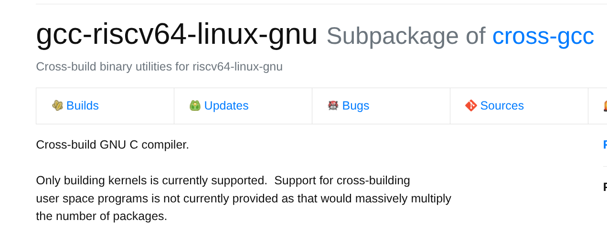
所以如果在x86的fedora用dnf装了gcc-riscv64也跑不了用户程序交叉编译，缺库。

直接使用教程里给出的tool然后配置一下bashrc或者profile就行

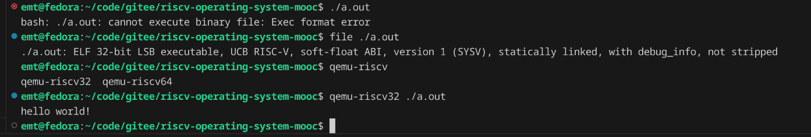

gdb对汇编单步调试，仿佛回到了手搓指令的实验课，这可简直不要太熟悉了。

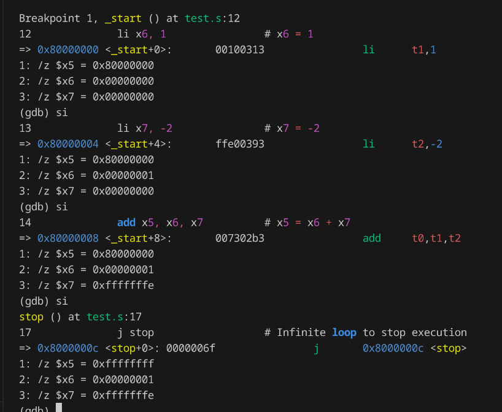

这里内容比较多，就不一一介绍。

下图是00-bootstrap启动成功截图，boot完控制权交给内核，此时内核进入一个空转状态。

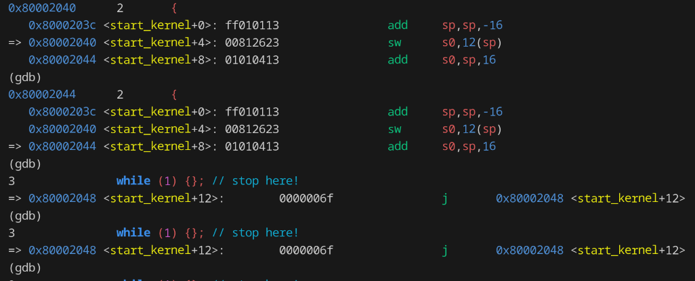

bootloader实现的很通俗易懂，主要是开辟一个堆栈给C，这时候C就可以来接管全局了。后续汇编也没有啥出现的必要，毕竟调试汇编和对着机器指令嗯写区别不大，都是地狱级别。

接下来的01-helloRVOS提到了UART，这个说起来感觉条条大陆通罗马。

之前大一还是大二来着，自个学C的时候就跑去玩51单片机、STM32和arduino，arduino玩起来最轻松，当时用的型号ESP8266好像，带wifi的，搞个面包板、几根杜邦线以及必不可少的LED灯，在arduino的板子起一个web server，和手机接入同一个局域网，就可以实现手机远控LED灯。后来的时候有个小课设还是什么来着，不太记得了，对着这个又做了版升级，加了个蓝牙模块和心率检测模块，光敏什么来着，捏在手里通过检测是否大于阈值能体现心率，同时还用kotlin写了个Android APP，拿okhttp通信，易用性上评价是不如python的request。现在看来这个arduino和这个内核不能说相似，只能说一模一样。同样还有波特率，这玩意太搞，115200/9600来着，对不上的话接受出来的数据是乱码的。

其实这玩意除了课程上接触过，经常路由器刷机的也不会陌生。以前特喜欢给爱机ax3000t刷高版本kernel的op，有次手抽把uboot搞崩了。拿牙签戳reset半天没响应，灯怎么也都不亮了。后续跑去恩山求助，搞来tty刷机大法，给ax3000t插杜邦线，再拿杜邦线转usb来插笔记本，重新强制刷一个uboot进去就好起来了。

视频倒是不急着看。先做做任务。导学部分的任务比较简单。没太有时间更新本篇blog。
直接贴gitee仓库，有兴趣可以看看

<https://gitee.com/emt_486/2025-exercises-stage-0>

### 2. 基础阶段

<https://gitee.com/emt_486/2025-exercises-stage-1>

### 3. 进阶阶段

<https://gitee.com/emt_486/2025-exercises-stage-2>

### 4. 项目阶段

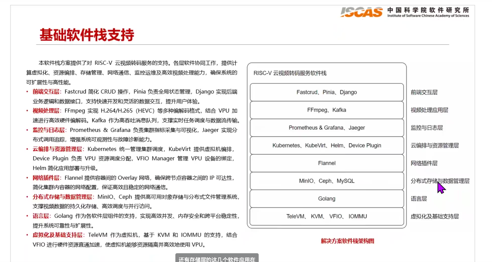

前端交互、监控与日志、网络插件、分布式存储与数据管理

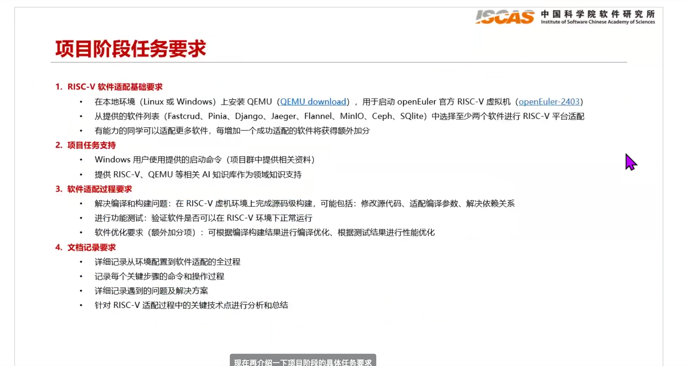

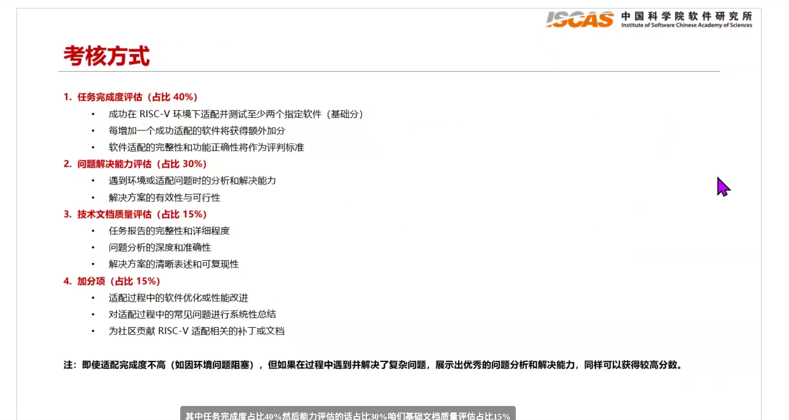

里面可以看到几个老熟人了，Django、MinIO，就先从老熟人下手吧，单独开两篇在同一目录下的blog来分别记录适配到riscv平台的过程。

下面的话先记录搭建本地环境的过程。

首先是安装qemu

```shell
sudo dnf install qemu -y
```

然后需要跑去下载openEuler的官方虚拟机，
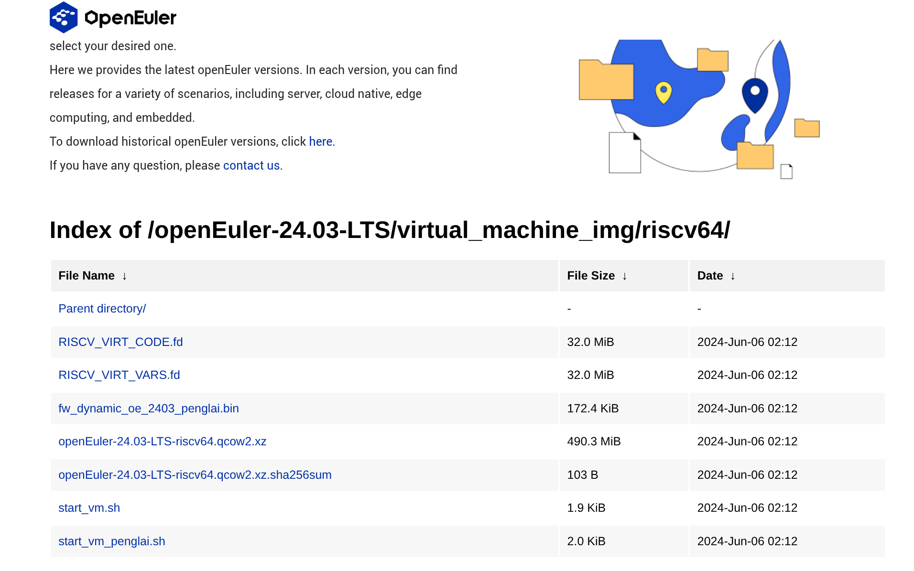

下载图里400多m的那个，下载完后解压得到qcow2格式的qemu虚拟机。这里为了方便，用了用Virtual Machine Manager这个GUI软件来拉虚拟机起来。具体就不多说了，把那个qcow2拷到/var/lib/libvirt/images下面，然后点几下就可以拉起来了。

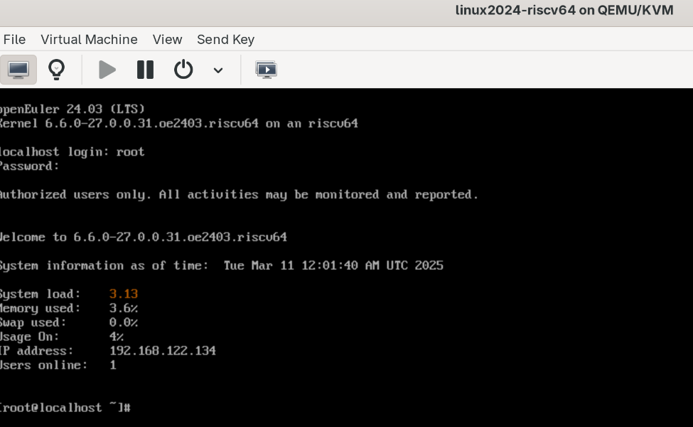

记得选择架构为riscv64，操作系统的话目前不支持显示openeular，选择linux2024即可

```shell
user:     root
password: openEuler12#$
```

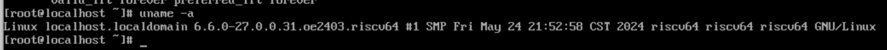

由于VMM自带终端界面太难用，使用ssh进去。这步比较简单，就不展开了。

基础环境算是配好了，现在来适配第一个熟人 ----> django 。请移步 [此处](./django_5.2_riscv.md)