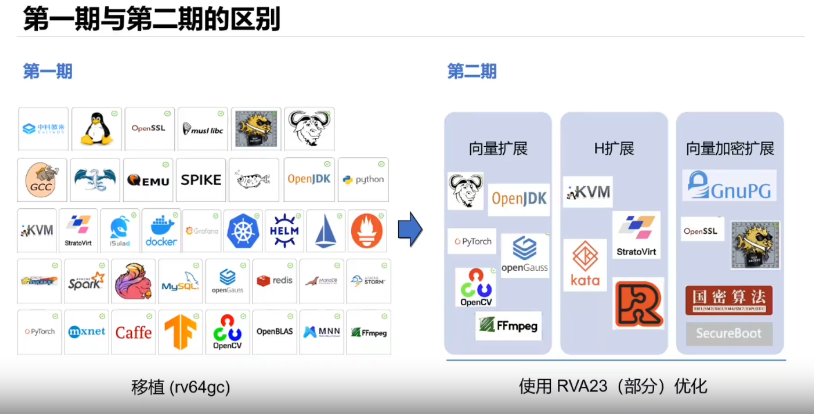
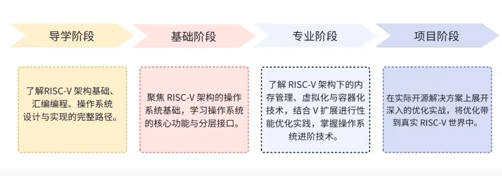
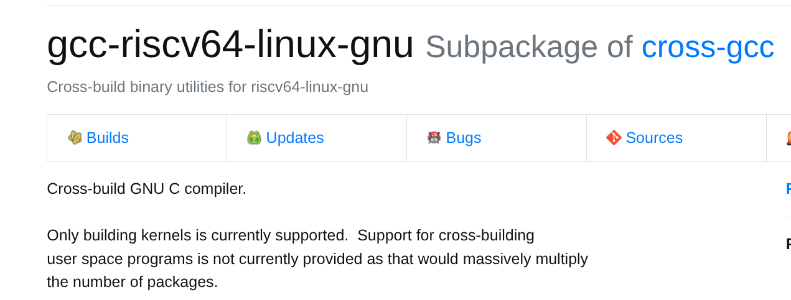
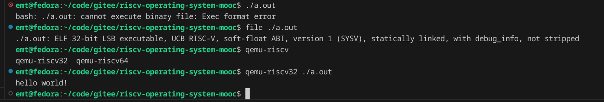

# 记录第二期傲来操作系统（EulixOS）训练营的实践内容

## 1.这是啥

一个以RISC-V为主的操作系统精简版教程。学习曲线相对平缓。

按照介绍来看，目前是第二期。第二期的主要方向如下

其中具体内容如下

按照上图里来看，分为了4个阶段，后续就按顺序来操作即可。

## 2. 实践过程

### 1. 导学阶段

b站视频，直接2倍速起飞看。还是很有意思的，前面主要是计组青春版+OS部分内容+编译原理部分内容。经历过计组用AHDL手搓指令实现，看这个教程就比较友好了。

配置环境的话，实测下来fedora是无法直接交叉编译的。原因如下。

所以如果在x86的fedora用dnf装了gcc-riscv64也跑不了用户程序交叉编译，缺库。

直接使用教程里给出的tool然后配置一下bashrc或者profile就行

