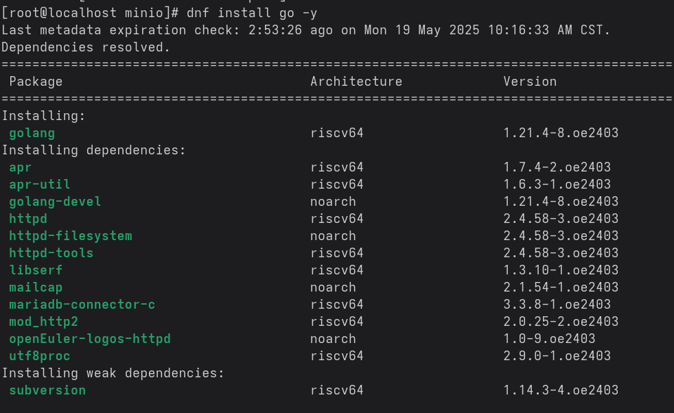

# minIO适配RV平台

## 适配对象

minIO RELEASE.2025-04-22T22-12-26Z，Github Repo -> [链接](https://github.com/minio/minio/tree/RELEASE.2025-04-22T22-12-26Z)

## 适配目标

能在openEuler的RISCV64环境跑起来。

## 适配过程

首先来看到的是minIO项目本身的README，里面列出了基本的安装、启动方式和支持的架构，minIO官方支持的架构嘛有x86、arm和PowerPC LE (ppc64le)，刚好这个适配工作就是为了让minIO能在RV上跑起来。

接下来再看到的是minIO项目本身所使用到的语言，在Github界面可以看到99%是Go，还有1%是other。Go的话本身跨平台、跨架构的支持能力还是不错的，提供了一些相对来说比较友好的支持，不至于说从零开始。没有使用cgo，这下交叉编译的难度一下就下去了，也就是minIO本身不会有太大的交叉编译问题，如果有的话，也是go编译器本来对于跨平台的支持问题。

说这么多，不如先来看看minIO怎么从源码构建出来一个能跑的二进制可执行程序。我们从最一般的流程入手，对于编译型语言，Go、C这些都需要依赖编译器来编译为二进制可执行程序，对于有一定规模的项目，都会使用脚本来辅助完成编译，c里面常见的就是使用make来进行编译，实质上是一种封装过的调用编译器来完成编译操作的脚本。在go这边可以选用make，不用的话简单写一个shell脚本包装一下go build的一些参数即可，都是等价的。所以我们去看构建流程的话，就需要优先去查看这些构建脚本。对这些脚本加上一些与git相关的hook，就可以换个名词，名为CI了。比如说当`git push`后触发自动构建流程，从源码打包出二进制产物。对于github平台，使用的CI工具是github action。（这些devops平台都大差不差）

所以对于在github上的开源项目，如果想查看他的构建流程，可以优先去看看项目根目录下是否有一个.github文件夹，这里会配置对应的CI脚本。对于minIO来说，也正在使用github action。细心找找，可以看到在[这里](https://github.com/minio/minio/blob/master/.github/workflows/go-cross.yml)。
核心在于最后的一句`make crosscompile`，在往上找找到Makefile里面的crosscompile，可以看到

```make
crosscompile:
   ## cross compile minio
   @(env bash $(PWD)/buildscripts/cross-compile.sh)
```

再顺藤摸瓜，可以看到里面的交叉编译脚本，[链接](https://github.com/minio/minio/blob/master/buildscripts/cross-compile.sh)

里面目前列出了`linux/ppc64le linux/mips64 linux/amd64 linux/arm64 linux/s390x darwin/arm64 darwin/amd64 freebsd/amd64 windows/amd64 linux/arm linux/386 netbsd/amd64 linux/mips openbsd/amd64`为`SUPPORTED_OSARCH`。咱们可以照猫画虎，加一个linux/riscv64。这里的列表可以在go官网找到go编译器支持的交叉编译的有效值，[链接](https://go.dev/doc/install/source#environment)。

首先需要安装Go,`dnf install go -y`。



注意到安装的Go版本为1.21.4。这里有个坑，昨天去琢磨过Go的交叉编译，说高版本后官方编译器的向前兼容只支持最近的两版本，比如1.24的话最好是1.22及以上，太老的版本官方不支持。（Go一年发两版本，LTS最长可以看作只有1年。）。在编译前我们需要看看怎么把需要的依赖给配置好。

来看一下go.mod

```plain
module github.com/minio/minio

go 1.24.0

toolchain go1.24.2

// Install tools using 'go install tool'.
tool (
        github.com/tinylib/msgp
        golang.org/x/tools/cmd/stringer
)

```

直接go build起手肯定是不行的。

```shell
[root@localhost minio]# go build
# output: 
#  go: errors parsing go.mod:
#  go.mod:8: unknown block type: tool
```

我们直接来手动装一个1.24的Go就行。记得把原有的1.21.4卸载了

```shell
# dnf remove go -y # 如果已安装Go
curl https://dl.google.com/go/go1.24.3.linux-riscv64.tar.gz -o go1.24.3.linux-riscv64.tar.gz
rm -rf /usr/local/go && tar -C /usr/local -xzf go1.24.3.linux-riscv64.tar.gz # 如果没有tar命令，需要dnf install tar -y
export PATH=$PATH:/usr/local/go/bin # 可设置到.bashrc或者.profile

# [root@localhost go]# go version
# go version go1.24.3 linux/riscv64
```

然后就可以直接执行`go mod tidy`。装依赖没有什么问题，大部分情况下都是网络问题，记得全程科学上网。最后就尝试一下`go build`。经过了约摸10-20分钟左右，编译结束，没有一点报错。编译出来得到了对应的二进制产物包。

```shell
-rwxr-xr-x  1 root root 140M May 19 19:09 minio

[root@localhost minio]# ./minio  -v
minio version DEVELOPMENT.GOGET (commit-id=DEVELOPMENT.GOGET)
Runtime: go1.24.3 linux/riscv64
License: GNU AGPLv3 - https://www.gnu.org/licenses/agpl-3.0.html
Copyright: 2015-0000 MinIO, Inc.

```

启动minIO

```shell
mkdir /data
[root@localhost minio]# ./minio server /data
INFO: Formatting 1st pool, 1 set(s), 1 drives per set.
INFO: WARNING: Host local has more than 0 drives of set. A host failure will result in data becoming unavailable.
MinIO Object Storage Server
Copyright: 2015-2025 MinIO, Inc.
License: GNU AGPLv3 - https://www.gnu.org/licenses/agpl-3.0.html
Version: DEVELOPMENT.GOGET (go1.24.3 linux/riscv64)

API: http://192.168.122.134:9000  http://127.0.0.1:9000 
   RootUser: minioadmin 
   RootPass: minioadmin 

WebUI: http://192.168.122.134:36165 http://127.0.0.1:36165   
   RootUser: minioadmin 
   RootPass: minioadmin 

CLI: https://min.io/docs/minio/linux/reference/minio-mc.html#quickstart
   $ mc alias set 'myminio' 'http://192.168.122.134:9000' 'minioadmin' 'minioadmin'

Docs: https://docs.min.io
WARN: Detected default credentials 'minioadmin:minioadmin', we recommend that you change these values with 'MINIO_ROOT_USER' and 'MINIO_ROOT_PASSWORD' environment variables

```

浏览器也能顺利访问到他的WebUI，简单的上传和下载文件的基本流程没有什么问题。（又忘记了一个关键事，git要checkout到RELEASE.2025-04-22T22-12-26Z。）

在`git checkout RELEASE.2025-04-22T22-12-26Z`之后，重新`go mod tidy`，再`go build`。同样的顺畅。接下来跑一下test。`make test`即可。可以看到会先进行lint，静态代码检查，这种一般不会有问题，有问题的话也不会作为release发出来。

```shell
[root@localhost minio]# make test
Installing golangci-lint
golangci/golangci-lint info checking GitHub for latest tag
golangci/golangci-lint info found version: 2.1.6 for v2.1.6/linux/riscv64
golangci/golangci-lint info installed .bin/golangci//golangci-lint
Installing msgp
Installing stringer
Running lint check
0 issues.
/bin/sh: line 1: typos: command not found
typos binary is not found.. skipping..
cmd/api-errors.go:81: running "stringer": exec: "stringer": executable file not found in $PATH
internal/bucket/bandwidth/monitor.go:20: running "msgp": exec: "msgp": executable file not found in $PATH
internal/bucket/lifecycle/lifecycle.go:54: running "stringer": exec: "stringer": executable file not found in $PATH
internal/bucket/replication/datatypes.go:20: running "msgp": exec: "msgp": executable file not found in $PATH
internal/dsync/lock-args.go:20: running "msgp": exec: "msgp": executable file not found in $PATH
internal/grid/debug.go:32: running "stringer": exec: "stringer": executable file not found in $PATH   
internal/logger/target/types/types.go:23: running "stringer": exec: "stringer": executable file not found in $PATH
make: *** [Makefile:36: check-gen] Error 1
```

lint完了，下一步执行的时候报了一点错，总算遇到报错了。环境变量加一下`export PATH=$PATH:$(go env GOPATH)/bin`，typos可能是一个检查拼写的工具，暂时不用安装(其实是我去看了眼[typos仓库](https://github.com/crate-ci/typos/releases/tag/v1.32.0)，release里没有RV64的，整个项目也基本是rust写的，弄一个RV64的出来比较麻烦，就先搁置了。)。

在加完环境变量之后，再次`make test`。

```shell
/bin/sh: line 1: typos: command not found
typos binary is not found.. skipping..
Checking dependencies
Arch 'riscv64' is not supported. Supported Arch: [x86_64, amd64, aarch64, ppc64le, arm*, s390x, loong64, loongarch64]
make: *** [Makefile:19: checks] Error 1
```

可以看到这里限定了支持的指令集架构，我们加一下RV64。在buildscripts/checkdeps.sh#L77，加一下riscv64。像这样
`x86_64 | amd64 | aarch64 | ppc64le | arm* | s390x | loong64 | loongarch64 | riscv64)`。这样就能过`checks`了。这个test本身会基于当前的Arch和OS来构建出minIO，所以不需要额外的调整就会构建出RV下的minIO然后进行测试。测试结果里有一些是Skipping的，原因是没配置etcd server。有一个超时抛出来panic导致整个test最后失败了。`FAIL github.com/minio/minio/cmd 605.620s`，这是比较主要的失败结果。

以下是具体的报错信息

```plain
panic: test timed out after 10m0s
 running tests:
  TestObjectCompleteMultipartUpload (6s)
  TestObjectCompleteMultipartUpload/compressed+versioned (1s)
```

这种超时10分钟显然是有大问题的。但不太可能是代码问题，如果是这样的话，这个版本也发不出来。于是经过简单的检索可得，有可能是`go test`本身的问题，运行超过10分钟后会自动抛出来这个panic，[参考链接](https://stackoverflow.com/questions/77095789/how-to-avoid-timeout-in-go-test-after-10m)。那就可以在`go test`后加一个参数，变为`go test -timeout 0`。具体是要去改动Makefile里的test里加上这个参数，变成这样

```make
test: verifiers build ## builds minio, runs linters, tests
        @echo "Running unit tests"
        @MINIO_API_REQUESTS_MAX=10000 CGO_ENABLED=0 go test -v -tags kqueue,dev ./... -timeout 0
```

重跑后抛了几个新的FAIL，依次解决

1.

```plain
=== RUN   TestIAMInternalIDPConcurrencyServerSuite/Test:_1,_ServerType:_ErasureSD
    admin-handlers-users-race_test.go:120: Unable to set user: context deadline exceeded

...
...

--- FAIL: TestIAMInternalIDPConcurrencyServerSuite (251.53s)
    --- FAIL: TestIAMInternalIDPConcurrencyServerSuite/Test:_1,_ServerType:_ErasureSD (93.51s)
    --- SKIP: TestIAMInternalIDPConcurrencyServerSuite/Test:_2,_ServerType:_ErasureSD_(with_etcd_backend) (0.00s)
    --- PASS: TestIAMInternalIDPConcurrencyServerSuite/Test:_3,_ServerType:_ErasureSD (51.60s)
    --- SKIP: TestIAMInternalIDPConcurrencyServerSuite/Test:_4,_ServerType:_ErasureSD_(with_etcd_backend) (0.00s)
    --- PASS: TestIAMInternalIDPConcurrencyServerSuite/Test:_5,_ServerType:_Erasure (49.33s)
    --- SKIP: TestIAMInternalIDPConcurrencyServerSuite/Test:_6,_ServerType:_Erasure_(with_etcd_backend) (0.00s)
    --- PASS: TestIAMInternalIDPConcurrencyServerSuite/Test:_7,_ServerType:_ErasureSet (57.06s)
    --- SKIP: TestIAMInternalIDPConcurrencyServerSuite/Test:_8,_ServerType:_ErasureSet_(with_etcd_backend) (0.00s)
```

指定这个函数重跑一次test，变成pass了

```plain
[root@localhost minio]# MINIO_API_REQUESTS_MAX=10000 CGO_ENABLED=0 go test -v -tags kqueue,dev -run TestIAMInternalIDPConcurrencyServerSuite ./cmd/ -timeout 0
=== RUN   TestIAMInternalIDPConcurrencyServerSuite
=== RUN   TestIAMInternalIDPConcurrencyServerSuite/Test:_1,_ServerType:_ErasureSD
=== RUN   TestIAMInternalIDPConcurrencyServerSuite/Test:_2,_ServerType:_ErasureSD_(with_etcd_backend)
    admin-handlers-users_test.go:150: Skipping etcd backend IAM test as no etcd server is configured.
=== RUN   TestIAMInternalIDPConcurrencyServerSuite/Test:_3,_ServerType:_ErasureSD
=== RUN   TestIAMInternalIDPConcurrencyServerSuite/Test:_4,_ServerType:_ErasureSD_(with_etcd_backend)
    admin-handlers-users_test.go:150: Skipping etcd backend IAM test as no etcd server is configured.
=== RUN   TestIAMInternalIDPConcurrencyServerSuite/Test:_5,_ServerType:_Erasure
=== RUN   TestIAMInternalIDPConcurrencyServerSuite/Test:_6,_ServerType:_Erasure_(with_etcd_backend)
    admin-handlers-users_test.go:150: Skipping etcd backend IAM test as no etcd server is configured.
=== RUN   TestIAMInternalIDPConcurrencyServerSuite/Test:_7,_ServerType:_ErasureSet
=== RUN   TestIAMInternalIDPConcurrencyServerSuite/Test:_8,_ServerType:_ErasureSet_(with_etcd_backend)
    admin-handlers-users_test.go:150: Skipping etcd backend IAM test as no etcd server is configured.
--- PASS: TestIAMInternalIDPConcurrencyServerSuite (179.57s)
    --- PASS: TestIAMInternalIDPConcurrencyServerSuite/Test:_1,_ServerType:_ErasureSD (56.42s)
    --- SKIP: TestIAMInternalIDPConcurrencyServerSuite/Test:_2,_ServerType:_ErasureSD_(with_etcd_backend) (0.00s)
    --- PASS: TestIAMInternalIDPConcurrencyServerSuite/Test:_3,_ServerType:_ErasureSD (37.04s)
    --- SKIP: TestIAMInternalIDPConcurrencyServerSuite/Test:_4,_ServerType:_ErasureSD_(with_etcd_backend) (0.00s)
    --- PASS: TestIAMInternalIDPConcurrencyServerSuite/Test:_5,_ServerType:_Erasure (43.05s)
    --- SKIP: TestIAMInternalIDPConcurrencyServerSuite/Test:_6,_ServerType:_Erasure_(with_etcd_backend) (0.00s)
    --- PASS: TestIAMInternalIDPConcurrencyServerSuite/Test:_7,_ServerType:_ErasureSet (43.04s)
    --- SKIP: TestIAMInternalIDPConcurrencyServerSuite/Test:_8,_ServerType:_ErasureSet_(with_etcd_backend) (0.00s)
PASS
ok   github.com/minio/minio/cmd 182.664s

```

又重跑了3次，没有复现FAIL。那可以当作PASS。

2.

```plain
=== RUN   TestReadDirFail
    os-readdir_test.go:58: expected = an error, got: nil
--- FAIL: TestReadDirFail (0.00s)


--- FAIL: TestXLStorageMakeVol (0.03s)
=== RUN   TestXLStorageDeleteVol
    xl-storage_test.go:665: expected: Permission error, got: %!s(<nil>)
--- FAIL: TestXLStorageDeleteVol (0.02s)


=== RUN   TestXLStorageListDir
    xl-storage_test.go:912: expected: file access denied, got: %!s(<nil>)
--- FAIL: TestXLStorageListDir (0.03s)

=== RUN   TestXLStorageDeleteFile
    xl-storage_test.go:1035: expected: file access denied, got: %!s(<nil>)
--- FAIL: TestXLStorageDeleteFile (0.02s)

=== RUN   TestXLStorageReadFile
    xl-storage_test.go:1255: expected: file access denied, got: EOF
--- FAIL: TestXLStorageReadFile (0.03s)

=== RUN   TestXLStorageAppendFile
    xl-storage_test.go:1417: expected: errFileAccessDenied error, got: %!s(<nil>)
--- FAIL: TestXLStorageAppendFile (0.02s)
```

这个不用猜，一眼就能看出是root用户的问题。改到普通用户重跑后一把直接过了。`make test`没有一点报错。在minIO的github action中有一个[go-lint](https://github.com/minio/minio/blob/master/.github/workflows/go-lint.yml)。主要执行的活是Linters and Tests。以下是比较关键的部分

```yaml
        env:
          CGO_ENABLED: 0
          GO111MODULE: on
        run: |
          sudo apt install jq -y
          sudo sysctl net.ipv6.conf.all.disable_ipv6=0
          sudo sysctl net.ipv6.conf.default.disable_ipv6=0
          make
          make test
          make test-race
```

`make`和`make test`都一把过了，接下来重新配一把环境变量CGO_ENABLED和GO111MODULE然后再跑一把。结果同样是一把过了。最后再来试试`make test-race`。结果如下

```plain
Running unit tests under -race
-race is not supported on linux/riscv64
make: *** [Makefile:92: test-race] Error 2
```

原因是因为go test不支持在RV架构下使用-race参数，详情可以看这里，[issue](https://github.com/golang/go/issues/64345)。早先就有人提出来这个问题了，维护者说是LLVM上游的尚未支持，后续LLVM支持了，现在Go还在等待进行更多的测试，有几个test过不了导致无法支持。所以的话，`make test-race`暂时就先不跑了。

那么就可以作出一个初步的总结，minIO能顺利在RV64上build成功，并且能通过默认的`make test`。并没有太多需要修改的东西。

## 向minIO社区提PR

那么现在就可以准备向minIO社区提PR，让其支持RV64。在动手之前要更多的了解现状，比如说看看有无前人尝试过该操作，看看做到了什么程度，我们能否利用一些可以利用的成果，尽可能避免重复造轮子以及走老路。我们的思路是很明确的，首先检索看看前人的努力，然后我们就决定一下是接着做，还是另起炉灶。并且把项目开发者对于之前的回复都收集起来，然后一次性做完，避免开发者再次回复相同内容。那么对于minIO适配RV的操作，我们除了这些以外，我们需要搓一个可复现的测试脚本，越简单越好，越简单就越容易复现。这个脚本内容需要把minIO该测的都测了，在提PR或者issue的时候才有数据/结果来作为支撑，也更容易被社区接受。

那么现在就按照上面提及的大方向来执行。

### 1. 现状

在minIO的github repo检索RISCV，可得如下结果。有两个PR，分别是

1. [Draft: Add RISCV64 as supported architecture](https://github.com/minio/minio/pull/17161)
2. [Add riscv64 support](https://github.com/minio/minio/pull/14601)

第一个PR中提及了准备将RV作为支持的架构，commit里做的修改是checkdeps.sh让能过依赖检查这一项。其中有个maintainer提议跑一下minIO自己的测试框架mint，后续的话这个PR就暂时没有PR了。第二个PR是在RV64下build不过的一个问题，里面加了下RV64下的构建约束，细节不用太关注，重点在于这个PR里还附带给出了测试结果。说明我们提PR的时候也需要把测试结果给出来。

### 2. 本地跑mint

那现在来照猫画虎。在经过`make`之后我们已经有了一个RV下的minIO，将其启动后就可以用于测试了。

```plain
[emt@localhost minio]$ file minio
minio: ELF 64-bit LSB executable, UCB RISC-V, double-float ABI, version 1 (SYSV), statically linked, BuildID[sha1]=168bd6834a8a49072db8a37cffe1e2e5e1706f19, stripped

[emt@localhost minio]$ ./minio server ~/data
MinIO Object Storage Server
Copyright: 2015-2025 MinIO, Inc.
License: GNU AGPLv3 - https://www.gnu.org/licenses/agpl-3.0.html
Version: DEVELOPMENT.2025-04-22T22-12-26Z (go1.24.3 linux/riscv64)

API: http://192.168.122.135:9000  http://127.0.0.1:9000 
   RootUser: minioadmin 
   RootPass: minioadmin 

WebUI: http://192.168.122.135:45643 http://127.0.0.1:45643   
   RootUser: minioadmin 
   RootPass: minioadmin 

CLI: https://min.io/docs/minio/linux/reference/minio-mc.html#quickstart
   $ mc alias set 'myminio' 'http://192.168.122.135:9000' 'minioadmin' 'minioadmin'

Docs: https://docs.min.io
WARN: Detected default credentials 'minioadmin:minioadmin', we recommend that you change these values with 'MINIO_ROOT_USER' and 'MINIO_ROOT_PASSWORD' environment variables

```

API的endpoint是192.168.122.135:9000，在浏览器打开的话会自动跳转到192.168.122.135:45643的WebUI页面。账号密码都是minioadmin。接下来再安装一下podman(docker同类，号称下一代容器)，`dnf install podman -y`。

下面来跑一下mint

```shell
podman run -e SERVER_ENDPOINT=192.168.122.135:9000 -e ACCESS_KEY=minioadmin \
             -e SECRET_KEY=minioadmin minio/mint
```

这里的endpoint改为启动服务器时输出的API endpoint即可。

运行结果如下

```plain
Running with
SERVER_ENDPOINT:      192.168.122.135:9000
ACCESS_KEY:           minioadmin
SECRET_KEY:           ***REDACTED***
ENABLE_HTTPS:         0
SERVER_REGION:        us-east-1
MINT_DATA_DIR:        /mint/data
MINT_MODE:            core
ENABLE_VIRTUAL_STYLE: 0
RUN_ON_FAIL:          0

To get logs, run 'docker cp :/mint/log /tmp/mint-logs'

(1/15) Running aws-sdk-go tests ... done in 1 seconds
(2/15) Running aws-sdk-java tests ... done in 1 seconds
(3/15) Running aws-sdk-java-v2 tests ... done in 2 seconds
(4/15) Running aws-sdk-php tests ... done in 44 seconds
(5/15) Running aws-sdk-ruby tests ... done in 5 seconds
(6/15) Running awscli tests ... done in 46 seconds
(7/15) Running healthcheck tests ... done in 1 seconds
(8/15) Running mc tests ... done in 1 minutes and 31 seconds
(9/15) Running minio-go tests ... done in 4 seconds
(10/15) Running minio-java tests ... FAILED in 17 seconds
{
  "name": "minio-java",
  "function": "listUsers()",
  "duration": 195,
  "status": "FAIL",
  "error": "org.bouncycastle.crypto.InvalidCipherTextException: mac check in GCM failed >>> [org.bouncycastle.crypto.modes.GCMBlockCipher.doFinal(Unknown Source), io.minio.admin.Crypto.decrypt(Crypto.java:190), io.minio.admin.MinioAdminClient.listUsers(MinioAdminClient.java:288), TestMinioAdminClient.listUsers(TestMinioAdminClient.java:136), TestMinioAdminClient.runAdminTests(TestMinioAdminClient.java:164), FunctionalTest.runTests(FunctionalTest.java:3783), FunctionalTest.runEndpointTests(FunctionalTest.java:3880), FunctionalTest.main(FunctionalTest.java:4001)]"
}
(10/15) Running minio-js tests ... done in 1 minutes and 32 seconds
(11/15) Running minio-py tests ... done in 19 seconds
(12/15) Running s3cmd tests ... done in 48 seconds
(13/15) Running s3select tests ... done in 4 seconds
(14/15) Running versioning tests ... FAILED in 3 seconds
{
  "alert": "",
  "args": {
    "bucketName": "versioning-test-w9l9hy3oqyonb3",
    "expiry": 60000000000,
    "objectName": "testObject"
  },
  "duration": 181,
  "error": "InvalidRequest: unknown wormMode directive\n\tstatus code: 400, request id: 1841862355DD21EA, host id: dd9025bab4ad464b049177c95eb6ebf374d3b3fd1af9251148b658df7ac2e3e8",
  "function": "/mint/build/versioning/legalhold.go:266: main.testLockingLegalhold",
  "message": "PUT expected to succeed but got InvalidRequest: unknown wormMode directive\n\tstatus code: 400, request id: 1841862355DD21EA, host id: dd9025bab4ad464b049177c95eb6ebf374d3b3fd1af9251148b658df7ac2e3e8",
  "name": "versioning",
  "status": "FAIL"
}

Executed 13 out of 15 tests successfully.
```

挂了2个。检索了一下第一个的问题，看样子是个历史问题，而且似乎和指令集架构有点关系。之前的问题说是有在m系mac（arm指令集）上部署minIO server报过这个[问题](https://github.com/minio/minio/discussions/20658)，切回到x86就正常了。maintainer在24年11月将其fix了，是这个[PR](https://github.com/minio/minio-java/pull/1597)。可以合理猜测是maintainer仅修了arm下的，RV的没人提所以没覆盖到。第二个问题暂时没啥头绪，先留着。把这次跑的日志dump一下，自个琢磨一下，看看能不能解解。

```shell
podman ps -a # 
CONTAINER ID  IMAGE                           COMMAND       CREATED         STATUS                     PORTS                   NAMES
cf66be589d6e  docker.io/library/redis:latest  redis-server  3 weeks ago     Exited (1) 3 weeks ago     6379/tcp                sad_bose
30dc8a0aa131  docker.io/library/redis:latest  redis-server  3 weeks ago     Exited (0) 3 weeks ago     0.0.0.0:6379->6379/tcp  intelligent_hoover
55210451a15a  docker.io/minio/mint:latest                   2 hours ago     Exited (1) 2 hours ago                             inspiring_engelbart
623b1cb5e804  docker.io/minio/mint:latest                   2 hours ago     Exited (1) 2 hours ago                             trusting_swirles
2ed3eacaa92e  docker.io/minio/mint:latest                   2 hours ago     Exited (1) 2 hours ago                             funny_gauss
2a537c5e1414  docker.io/minio/mint:latest                   22 minutes ago  Exited (1) 15 minutes ago                          practical_mclean

podman  cp 2a537c5e1414:/mint/log /tmp/mint-logs # 2a537c5e1414改为最后运行mint的容器，在这里上面ps -a列出的最后一个
```

日志dump出来，但比较怪的是都是空，里面啥都没。把环境清空，重新跑一把。结果不变，说明是代码问题，能稳定复现。具体的日志内容同样为空。此时突然想起maintainer回复里提到过mint要跑的是edge版本而不是latest，在切换版本后重跑后果然通过了。

### 3. 提issue

在此期间，我顺带向minIO提了一个issue询问相关情况，[issue链接](https://github.com/minio/minio/issues/21298)。

大概情况是这样，我提issue请求支持RV，并附带上测试结果。maintainer回复说minIO不再接受新的功能相关的请求，更何况是新指令集架构的支持。随后我提问如果提PR的话是否会被合并，maintainer回复说可以合，但是不会将RV标记为支持。再后续我简单写了一个用于复现测试结果的脚本，等待maintainer回复。

下面来简单介绍一下这个[测试脚本](./server.sh)`server.sh`。宿主机为fedora42。我们首先在宿主机安装qemu、sshpass、podman这些。然后去拉取openeuler作为虚拟机镜像。拉取完后就可以启动虚拟机，虚拟机转发出来三个端口，2222、9000、9001，分别用于ssh进去虚拟机、minIO的API、minIO的WebUI。为了等待虚拟机完全启动，在脚本需要sleep一下。最后sshpass指定用户名密码把要在虚拟机执行的脚本`run.sh`用scp复制进去，然后在ssh上去执行脚本`run.sh`。

接下来介绍一下[`run.sh`](./run.sh)。这个脚本是在虚拟机里面执行的。首先纠正一下时间，避免出现ssl证书验证失败导致的dnf无法下载或者更新的问题。然后安装一下git、make这些。随后git clone minio，安装1.24.3的Go。环境就算配好了（Go就是如此的朴实无华）。直接`go mod tidy`一键下载好minIO需要的依赖，再sed改一下让支持RISCV，就可以开始`make`了，是本地编译。编译结束后就可以启动minIO了，此时会一直占用着当前终端。

在浏览器打开127.0.0.1:9000会自动跳往127.0.0.1:90001的WebUI，账号密码都是minioadmin，进进去后即可在web界面操作minIO。

接下来就可以在本地启动mint，执行对于minIO server的测试。只需要一条命令，`podman run -e SERVER_ENDPOINT=host.docker.internal:9000 -e ACCESS_KEY=minioadmin -e SECRET_KEY=minioadmin docker.io/minio/mint:edge`，即可完成测试，测试结果在fedora42完全通过。

以上这些信息均已在issue中反馈给maintainer了，等待进一步的回复，如果maintainer觉得ok的话，再去提PR。

## 适配结论

在RV上运行minIO，只需要修改`buildscripts/checkdeps.sh`里的支持的指令集架构，然后直接make即可得到对应的二进制产物，通过对该产物进行测试可得，`make test`通过，minIO项目的测试框架mint也测试通过。`make test-race`测试失败，原因是`go test -race`尚不支持RV架构，属于go项目本身的支持问题，与minIO无关，待后续go项目支持后，即可对minIO进行更进一步的测试。

在RV上，minIO基本可用，不存在过多复杂的编译问题。初步估计原因为minIO基本为纯go实现，未依赖具体某平台的原生实现，故移植性、兼容性基本与go项目本身支持的程度一致。

由于时间问题，仅向minIO社区提起了issue，待maintainer后续进一步回复后，可以进一步提PR并完善对于RV的支持。但需要指出的一点是，maintainer提及不会将RV标记为支持的架构。
