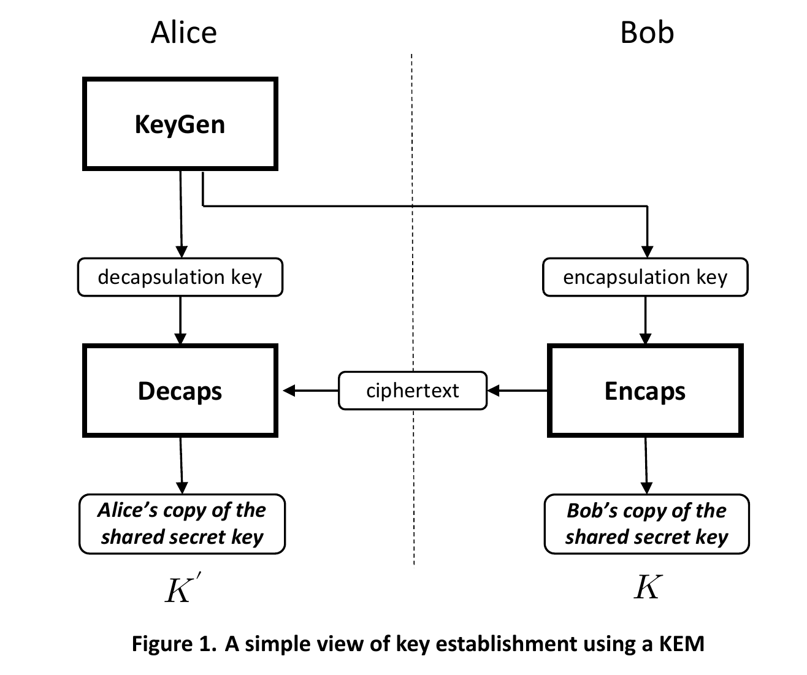
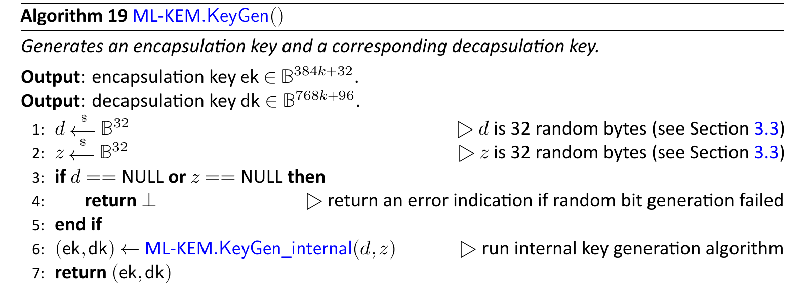

# 加密

## 0. 前言

最近在上一个量子计算的课，要写一篇报告，有关量子算法或者量子编程或者参加相关比赛，报告截止时间比较微妙，打比赛的途径是指望不上了。那就自然而然选个量子算法介绍一下就差不多了。

不过依我所知，我一无所知。通过翻阅课件可知，课程里提到了几个算法，shor、grover、Deutsch Algorithm等。那这下真是触发关键字了，大名鼎鼎的秀尔算法，**有望**能干翻现有的什么RSA、ED25519等非对称加密算法。美国国家标准与技术研究院 (NIST)为了抵抗这个威胁，推出了[PQC](https://zh.wikipedia.org/wiki/%E5%90%8E%E9%87%8F%E5%AD%90%E5%AF%86%E7%A0%81%E5%AD%A6)（Post-quantum cryptography，后量子密码学）标准，给出了三个标准算法。

正好，密码学这块我也一直觉得挺有意思的，就顺便把琢磨过程写出来，以供后来者参考。本篇blog内容会比较散，大概围绕密码学介绍一下相关的内容。

以下按照惯例先回答几个我感觉可能会被问到的问题。

### 1. 哪听说到的shor算法，在上量子计算课之前？

有个b站up主，[硬件茶谈](https://space.bilibili.com/14871346)，之前爱看他的装机视频，后来出了一期加密有关的[视频](https://www.bilibili.com/video/BV1Eo4y1y7Dh/)，里面提及了shor算法。

### 2. 之前了解过多少的密码学有关知识？

这个话题就比较大了。我本身不是干信安的，密码学了解不多。只是在一门公开课上听过一些对称加密、非对称加密、公私钥、签名验签、证书之类的。后续阴差阳错又琢磨了一段时间的密码学，了解了比如说轮换、置换等用来加密，杂凑、HMAC、加盐、SHA系列、md系列等哈希相关的名词，对称加密里又听说过DES、3DES、AES等，在非对称加密里就有RSA、ECC、ECDSA、D-H交换、ED25519、DSA等，以及国产的一些sm系列算法。仅限于听说过这些名词，知道大概能干嘛的。相关的库听过比如openssl、boring ssl，这个boring ssl从quic协议那边听来的，说openssl支持缓慢，要装这个boring ssl才能用quic。还听过一些就是TLS1.3淘汰了一些比如md5、RSA等。

再有就是看过一点点点点的openssl里面的源码，在c看到了有一堆的函数指针、上千行的函数，小小的震撼了只会hello world的我。

### 3. 为什么对密码学感兴趣？

最早觉得比较神奇的是SSH的密钥登陆，不用输入密码来登陆，而且安全性比我记住的哪怕是几十位密码都要高，背后的巧妙原理正是非对称加密。

2022年Apple推出来的passkey通行密钥能实现免密登陆，旨在加速淘汰传统的密码登陆，这里同样是非对称加密在背后支撑。

这些应用场景很难不让人对其背后的原理感兴趣。

## 1. 加密

指望通过本篇blog来学习密码学是不可能的。更加正确的做法应该是去寻找相关的专业课程学习。

本篇blog仅仅只是我自己对于密码学的一些见解与看法

在信息安全这边有个词特别出名，不安全的信道，也就是传输信息的通道是不安全的，从这条通道传输的数据都存在被监听的可能。

被监听肯定是不合适的，那我们就要想一种办法来保护我们要传输的数据。于是乎就有了两个专有名词，明文（待传达给对方的信息或者数据，但不能直接传输明文，因为会被监听到，信息也就泄露了），密文（可以直接在不安全的信道上传输的数据，对明文加密而得到密文）。密文需要满足一个条件，一定要能够还原得到明文，如果无法还原得到明文，那这个加密就是无效的。亦即对密文解密能够得到明文。

于是乎，我们可以来看看hash算法能否用来当作加密算法，比如说使用常见的md5，现在我把linux源码给hash了，得到一个16字节的哈希值，然后把哈希值当作密文传输给对方。如果有人能从这16个字节中**解密**得到linux源码，那这个技术是相当颠覆性的存在。其实这里背后藏着一个概念，信息，信息是对不确定性的消除。所谓信息量大，也就是说这个信息承载的数据量大。那么显然，hash的过程发生了信息丢失。16字节的哈希值是无法承载linux源码所需要表示出来的信息。那这个16字节的哈希值表示了什么？linux源码的哈希值。如果linux源码中有了一些修改，重新对其使用md5计算，就可以得到一个新的哈希值。

那么现在再来看看各种**编码形式**，比如说ASCII编码，用数字来表示字母。那么假设用来当作加密算法，也就是从明文的字符串转换为数字来传输

```python
>>> [ord(i) for i in "Hello World!"]
[72, 101, 108, 108, 111, 32, 87, 111, 114, 108, 100, 33]
```

我在纸上写的不是"Hello World!"，而是 [72, 101, 108, 108, 111, 32, 87, 111, 114, 108, 100, 33]，然后传输这个纸条给目标对象。这显然没有保密，因为只需要拥有ASCII表即可快速解密。所以那些各式各样的编码格式，只不过是换了一种**众人都知道的**编码与解码格式的数据表现形式。将信息转换为不同形式是为了方便传输数据或者实现其他的目的。

比如ASCII是为了解决计算机只认识0101,而不认识字符的问题而发明出来的。

又比如BASE64编码格式，发明出来就是为了用文本形式来表示二进制数据。有些协议只支持传输文本形式的数据，比如电子邮件中把二进制形式的文件用文本形式的字符串表示出来，这样就能够**兼容** *历史遗留*。有一个比较有意思的场景，如果图片比较小，可以不使用外链的形式，直接把这个图片的base64编码形式贴出来也可以当作图片来显示。亦即二者表现形式是等价的。不同格式就是为了面向不同场景而诞生的，其所表示的内容都是同一个内容。（编码格式的内容在后面还会提及）

经过BASE64编码的字符串体积会上涨。如果都是二进制形式的传输就没有必要再编码一层，无意义的套娃操作，直接传输二进制数据就完事了。

现在终于可以来看看加密了。将明文加密为密文，密文在适当的解密算法下可以解密得到明文。那么，是否就可以把密文当作明文的一种特殊表示形式，只不过这种形式只有特定的解密操作才能够将密文转换回来得到明文。如果从这个角度来看待编码格式，那么上面所提及的ascii编码、base64编码，以及未提及但是也很出名的摩尔斯电码，都是*没有加密作用*的编码，因为人人都知道如何*解密*。不过为了方便起见，我们一般还是默认编码操作不会起加密作用，而把加密这种特殊的*编码形式*专门称为加密。这样的话，就比较容易区分二者了。

那么在加密这个操作里，其实可以分为两部分，一个是加密算法，一个是加密密钥。为啥要区分开来这两个呢？

我们可以这样来想象一下加密，我们现在有一个明文，将加密为密文。这个过程看作是在一个迷宫里，把起点当作明文，现在我们走进迷宫里，停下来的时候，我们处在了迷宫当中，把此时的坐标当作密文，传输给待通信的对方。那么解密操作就可以理解为从停下来的位置回到起点。如果怎么走，都走不到起点，说明这个加密是无效的。

那么现在最有意思的来了，其实即使是上文提及的把linux源码给hash得到了一个只有16字节的md5值，我们依旧有办法根据这个md5值来得到linux源码，办法当然就是从宇宙诞生时就开始枚举所有的字符串组合，一个一个试，把所有组合都试个遍，直到试出有相同hash值的字符串。不过还得要处理出现hash碰撞的情况。尽管很概率极低，但是概率还是比不当🃏要高一点的。
（这个问题，其实背后有个有意思的定理，[无限猴子定理](https://zh.m.wikipedia.org/wiki/%E7%84%A1%E9%99%90%E7%8C%B4%E5%AD%90%E5%AE%9A%E7%90%86)）

我们可以把迷宫的设计当作是加密算法的设计，加解密的密钥就是告诉我们怎么走这个迷宫。
迷宫设计的越复杂，当然安全性越高。不过如果怎么走迷宫都被泄露了的话，安全性再高的迷宫都白瞎了。

那现在在密码学里一般认为比较安全的做法是，公开加解密使用的算法，保管用于加解密的密钥。因为加解密算法公开的话，出现后门是比较小概率的事件，大家都使用公认的比较安全的算法，这种操作往往都是比较安全的。只要加解密的密钥不泄露，那我们的信息传输就是安全的。

那有没有不公开的加解密算法呢？有，我国的sm1算法，sm表示商用密码的意思。在国企政企可能就会使用。

关于迷宫怎么设计的问题，密码学也有一个很经典的看法，不要自己设计加解密算法。比如不要用两次aes128来代替aes256，这种操作是让人疑惑的。

加解密算法分为两类，对称式加密算法和非对称式加密算法。所谓对称不对称，即加解密时是否使用同一把密钥。常见比如AES对称式加密，说明其在加解密时使用同一把密钥。像RSA、ED25519这些非对称式加密，则会有密钥对的概念，一个是公钥，另一个是与之对应的私钥，一般使用公钥来加密，私钥来解密。

可以很轻易的发现，在AES中，他的加解密算法是公开，密钥是自己持有的。如果说要加密数据，就使用密钥加密即可。但是如果解密的话，就同样需要使用密钥来解密。那么现在问题来了，一般来说，执行加解密的操作往往不是同一个人，加密的时候使用密钥加密没问题，可是解密的时候需要密钥，密钥怎么给到对方呢？这就是密钥分发问题。

在密钥分发问题中，有一个比较有意思的话题，有一种绝对安全的方法来实现加解密，一次性密码本（one-time pad，OTP），不单单只是用了一次密码来加解密就扔了就可以叫做OTP，他有三个条件需要满足，密码是随机生成的，**密码至少要和明文一样长**，密码只能用一次。信息学之父香农证明了这个密码是绝对安全的。如果我要用OTP来加解密，首先要解决的就是怎么把这个和明文等长的密码安全的分发给对方，如果我都能安全的分发这个一次性的密码，我还不如直接安全的分发明文，要密码做什么😈。

本篇blog不打算介绍传统的AES、RSA算法等的证明、使用等，因为网上已经有足够多的教程来介绍了。本篇blog打算来介绍一下ML-KEM。

本篇刚开始提及了NIST为了抵抗量子计算机对传统加密算法的威胁，征集并推出了[三个PQC算法](https://csrc.nist.gov/projects/post-quantum-cryptography)，其中有一个是ML-KEM（Module-Lattice-Based Key-Encapsulation Mechanism Standard，基于模块格的密钥封装机制）。

## 2. ML-KEM

所谓密钥封装机制，可以看作密钥交换的另一种叫法（以前那个DH协议，全称叫做Diffie–Hellman key exchange）。也就是这个ML-KEM提供了一种密钥封装的算法，能够用于传输对称式加密中需要事先交换的密钥。

这里是NIST给出的标准,[链接](https://csrc.nist.gov/pubs/fips/203/final),更具体点的pdf文档在[这里](https://doi.org/10.6028/NIST.FIPS.203)。

先不提及里面的专业术语，就这篇标准来说，写的极其用心，极其佩服撰写这篇标准的作者们。即使不是专门学习过密码学的外行，细心钻读这篇标准也能看懂ML-KEM的基本原理+实现。恰好Go1.24刚发布不久，里面[有一个更新](https://go.dev/doc/go1.24#crypto-mlkem)就是内置库添加了对于ML-KEM的支持，我果断打开源码一看，好家伙，基本就是对着标准来逐行翻译。边看标准边看Go这边的内置库实现，二者都极其赏心悦目。

以下内容基本来自FISP 203 标准。

首先贴出一张**来自标准里**介绍这个算法的图，一图胜千言



首先Alice生成一对用于封装和解封装的密钥对，简称ek、dk，其实分别是公钥、私钥。ek可以分发给Bob或者其他想要执行密钥封装的对象。dk则Alice自己持有。

Bob如果想要和Alice协商出一个共享密钥K，那Bob需要事先获得Alice的ek，然后执行封装算法（Encaps），得到密文c和共享密钥K，密钥K可用于对称式加密使用，Bob自己持有即可。Bob需要将密文c直接传输给Alice。（在这里即使密文c被截获也无法得知密钥K，从密文c中解出密钥K需要有Alice的dk，而Alice的dk只有Alice有）

Alice在收到密文后，使用dk以及解封装算法（Decaps）来得到共享密钥K'，在极大部分情况下Bob的K和Alice从密文中解出得到K'相同，只有在非常非常极端的情况下会不相等（实际应用中可以忽略不计）。

总结一下ML-KEM分为三步，密钥生成、封装密钥、解封装密钥。

Go官方的ml-kem库给了一个[example](https://pkg.go.dev/crypto/mlkem#pkg-overview)，可以对照着上面的步骤来看。

### 2.1 密钥生成

这里写起来就比较硬核了，需要一点点啃。

**以下所有图片均来自FIPS 203 标准**

先来看看整体的最外层，密钥生成自然不需要任何输入，输出有ek和dk。ek对外公布，dk保密。



首先是生成两个随机数𝑑和𝑧，都是32字节的。生成随机数后将两者作为参数传入 ML-KEM.KeyGen_internal 。返回得到(ek,dk)二元组。

这里可以和Go的ml-kem库实现一起来看。

```Go
func generateKey(dk *DecapsulationKey768) (*DecapsulationKey768, error) {
	var d [32]byte
	drbg.Read(d[:])
	var z [32]byte
	drbg.Read(z[:])
	kemKeyGen(dk, &d, &z)
	if err := fips140.PCT("ML-KEM PCT", func() error { return kemPCT(dk) }); err != nil {
		// This clearly can't happen, but FIPS 140-3 requires us to check.
		panic(err)
	}
	fips140.RecordApproved()
	return dk, nil
}
```

可以看到同样是生成了两个随机数，至于里面是怎么生成的，暂时不用管，后面有空再来填坑了。

(小彩蛋，注意看generateKey里面的注释。我记得好像gcc源码里也有一个类似说，xxx标准还是委员会说this is a macro，make them happy)

那么里面的kemKeyGen就是重头戏了。但是要先来看看标准里怎么做的


### 2.2 封装密钥

### 2.3 解封装密钥

## -1. 一些有用的参考链接

1. [Google Cloud对于加密的介绍](https://cloud.google.com/learn/what-is-encryption?hl=zh-CN)
2. [Wikipedia对于密码学的介绍](https://zh.wikipedia.org/wiki/%E5%AF%86%E7%A0%81%E5%AD%A6)
3. [ctf-wiki对于密码学的介绍](https://ctf-wiki.org/crypto/introduction/)
4. [cloudflare对于加密的介绍](https://www.cloudflare-cn.com/learning/ssl/what-is-encryption/)
